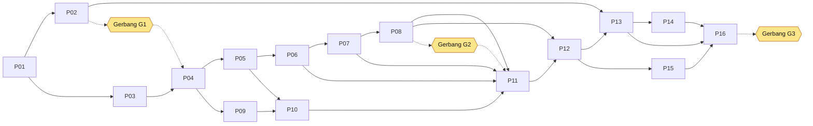

# Rencana Implementasi — Mini App TTE PDF (MVP)

| Atribut   | Nilai                                                                                  |
| --------- | -------------------------------------------------------------------------------------- |
| Versi     | 1.0 — 26 September 2026                                                                |
| Acuan     | [`docs/PRD.md`](PRD.md) (sumber kebenaran requirement)                                 |
| Pelacakan | [`docs/TODO.md`](TODO.md)                                                              |
| Eksekusi  | [`prompts/`](../prompts/00-README.md) — 16 prompt bertahap untuk agen AI (Claude Code) |

---

## 1. Cara Memakai Dokumen Ini

1. **PRD** menjawab _apa_ dan _mengapa_. **PLAN** menjawab _bagaimana_ dan _urutannya_. **Prompt** adalah instruksi eksekusi per tahap.
2. Jalankan prompt **berurutan** (P01 → P16). Setiap prompt memiliki dependensi, kriteria selesai, dan perintah verifikasi.
3. Setelah setiap prompt: kriteria selesai terverifikasi → centang di `docs/TODO.md` → commit.
4. Ada **3 gerbang review manusia** (§9). Jangan lanjut melewati gerbang tanpa persetujuan.
5. Deviasi dari PRD dicatat sebagai ADR di `docs/adr/` dan disebut di laporan akhir prompt.

---

## 2. Keputusan Teknis (Decision Log)

| ID   | Keputusan                                                                                                   | Alasan                                                                                      | Referensi PRD       |
| ---- | ----------------------------------------------------------------------------------------------------------- | ------------------------------------------------------------------------------------------- | ------------------- |
| D-01 | Backend **Python 3.13 + FastAPI + Uvicorn**                                                                 | Ekosistem PAdES terbaik (pyHanko), OpenAPI otomatis.                                        | §9.3                |
| D-02 | **pyHanko 0.37.x** untuk sign & verify PAdES                                                                | Satu-satunya library open-source dengan B-B s.d. B-LTA + validasi lengkap.                  | FR-12, FR-13, FR-15 |
| D-03 | **PyMuPDF 1.28.x** untuk inspect/stamp/render, di balik antarmuka `StampEngine`                             | Cepat & akurat; isolasi agar dapat diganti bila lisensi AGPL ditolak.                       | R-03                |
| D-04 | Tampilan PAdES = **signature widget appearance** (bukan flatten)                                            | Incremental, multi-penanda tangan aman, klik tanda tangan di Acrobat membuka detail.        | FR-12, FR-19        |
| D-05 | Teks tanda tangan dirender server-side ke **PNG** (Pillow + font OFL)                                       | WYSIWYG, satu pipeline untuk tiga tipe aset, menghindari dependency font native di pyHanko. | FR-05               |
| D-06 | Koordinat kanonik = **rasio halaman tampilan, asal kiri-atas**; konversi di `app/domain/coords.py`          | Zoom-independent; satu sumber kebenaran; teruji dengan test vector bersama FE/BE.           | §9.4, Lampiran C    |
| D-07 | Operasi PDF di **ProcessPoolExecutor** (`forkserver`) dengan timeout                                        | PyMuPDF tidak thread-safe; isolasi PDF berbahaya; crash tidak menjatuhkan API.              | NFR-SEC-04          |
| D-08 | Penyimpanan **berkas lokal + sidecar JSON** di `TTE_DATA_DIR`, TTL + janitor                                | Tanpa database; cukup untuk single-instance MVP.                                            | FR-20               |
| D-09 | Frontend **Vanilla JS + Vite + pdfjs-dist + signature_pad**; drag/resize native Pointer Events              | Ringan, dependency minimal, kontrol penuh.                                                  | §9.3                |
| D-10 | Paket Python dikelola **uv**; image memakai `requirements.txt` hasil `uv export` (dengan hash)              | Build reprodusibel, `--require-hashes`.                                                     | NFR-SEC-08          |
| D-11 | PKI & TSA/OCSP uji memakai **certomancer**                                                                  | PKI deklaratif + mock layanan untuk B-T/B-LT/B-LTA.                                         | Lampiran D          |
| D-12 | Image **`python:3.13-alpine3.24`** multi-stage, `tini`, non-root 10001                                      | Requirement Alpine; hasil spike P02 dapat merevisi (ADR-0001).                              | FR-17, §9.5         |
| D-13 | Error **RFC 9457** + kode stabil; `X-Request-ID`                                                            | Konsistensi untuk integrator.                                                               | FR-16, Lampiran A.4 |
| D-14 | Audit **JSON Lines + hash chain**                                                                           | Tamper-evident tanpa database.                                                              | FR-18               |
| D-15 | Konvensi bahasa: **kode & komentar dalam bahasa Inggris**, **teks UI & dokumentasi dalam Bahasa Indonesia** | Standar industri + kebutuhan pengguna.                                                      | NFR-I18N-01         |

---

## 3. Struktur Repositori Target

```
tte/
├── CLAUDE.md                     # aturan kerja agen
├── README.md
├── Makefile
├── docker-compose.yml
├── .dockerignore  .gitignore  .editorconfig
├── .github/workflows/ci.yml
├── docker/
│   ├── Dockerfile                # multi-stage Alpine (P13)
│   └── spike/                    # spike kompatibilitas (P02)
├── docs/
│   ├── PRD.md  PLAN.md  TODO.md
│   ├── API.md  DEPLOY.md  RUNBOOK.md
│   ├── adr/                      # 0001-alpine-native-deps.md, 0002-pymupdf-license.md, ...
│   ├── api/openapi.json          # hasil ekspor (dicek drift di CI)
│   └── qa/                       # laporan performa, checklist manual
├── shared/
│   └── test-vectors/coords.json  # vektor uji koordinat FE/BE
├── scripts/                      # smoke.sh, image-check.sh, gen_apikey, dll.
├── backend/
│   ├── pyproject.toml  uv.lock  requirements.txt
│   ├── app/
│   │   ├── __main__.py  main.py  config.py
│   │   ├── api/v1/               # health, config, documents, assets, stamp, pades, verify
│   │   ├── core/                 # errors, logging, middleware, security, audit, ratelimit
│   │   ├── domain/               # schemas, coords
│   │   ├── services/             # storage, worker_pool, pdf_inspect, asset_service,
│   │   │                         # text_renderer, stamp_engine, pades_signer, pades_verifier,
│   │   │                         # trust_store, janitor
│   │   ├── signers/              # base, pkcs12, server
│   │   ├── tools/                # apikey, verify_audit
│   │   ├── cli.py                # CLI `tte` (P15)
│   │   └── assets/fonts/         # font OFL + lisensi
│   └── tests/
│       ├── unit/  integration/  visual/
│       ├── pki/                  # konfigurasi certomancer
│       └── fixtures/             # generator PDF uji
└── frontend/
    ├── package.json  package-lock.json  vite.config.js
    ├── index.html  verify.html
    ├── src/
    │   ├── main.js  verify.js
    │   ├── api/  state/  viewer/  upload/  overlay/  signature/  dialogs/  ui/  i18n/  styles/
    │   └── coords.js
    └── tests/  (unit: vitest)  e2e/ (playwright)
```

---

## 4. Milestone

| Milestone                | Isi                                         | Prompt  | Exit Criteria                                                                            | Target     |
| ------------------------ | ------------------------------------------- | ------- | ---------------------------------------------------------------------------------------- | ---------- |
| **M0 — Fondasi & Spike** | Scaffold, spike Alpine, PKI & fixture uji   | P01–P03 | Sign/verify/stamp jalan di container Alpine; ADR-0001 & ADR-0002 ditulis; **Gerbang G1** | Minggu 1   |
| **M1 — Inti Dokumen**    | Dokumen, aset, koordinat, stamp             | P04–P06 | Stamp akurat ≤ 1 pt di matriks rotasi/CropBox                                            | Minggu 2–3 |
| **M2 — PAdES**           | Sign B-B/B-T/B-LT(/B-LTA) + verify          | P07–P08 | Korpus verifikasi 100%; validasi silang pyHanko CLI; **Gerbang G2**                      | Minggu 3–4 |
| **M3 — Frontend**        | Viewer, panel, placement, unduh, verifikasi | P09–P11 | Alur stamp & PAdES jalan end-to-end di browser                                           | Minggu 4–6 |
| **M4 — Siap Rilis**      | Keamanan, Docker, QA, dokumentasi, CI/CD    | P12–P16 | Checklist PRD §17 terpenuhi; **Gerbang G3**                                              | Minggu 7–8 |

---

## 5. Rincian Pekerjaan per Prompt

| Prompt                                                 | Judul                                           | Bergantung   | Keluaran Utama                                                                                                                                          | Estimasi*  | FR/NFR                     |
| ------------------------------------------------------ | ----------------------------------------------- | ------------ | ------------------------------------------------------------------------------------------------------------------------------------------------------- | ---------- | -------------------------- |
| [P01](../prompts/01-scaffold-monorepo.md)              | Scaffold monorepo & fondasi backend/frontend    | —            | Struktur repo, FastAPI skeleton (config, error RFC 9457, logging JSON, request-id, audit hash-chain, health, config), Vite skeleton, Makefile, CI dasar | 0,5–1 hari | FR-16, FR-18, NFR-OBS      |
| [P02](../prompts/02-spike-alpine-compat.md)            | Spike kompatibilitas Alpine/musl                | P01          | `docker/spike/`, laporan wheel & ukuran, ADR-0001, ADR-0002 (draf), versi dependency ter-_pin_                                                          | 1 hari     | R-01, R-02, R-03           |
| [P03](../prompts/03-test-pki-fixtures.md)              | PKI uji, mock TSA/OCSP, fixture PDF             | P01          | Konfigurasi certomancer, p12 uji, generator PDF (Lampiran D), fixture pytest                                                                            | 1 hari     | Lampiran D                 |
| [P04](../prompts/04-backend-documents.md)              | API dokumen, storage TTL, worker pool, inspeksi | P01, P03     | `/documents` CRUD, janitor, process pool, deteksi tanda tangan                                                                                          | 1,5 hari   | FR-01, FR-19, FR-20        |
| [P05](../prompts/05-backend-assets-coords.md)          | Aset tanda tangan & modul koordinat             | P04          | `/assets`, render teks, sanitasi gambar, `coords.py`, `shared/test-vectors/coords.json`                                                                 | 1,5 hari   | FR-04–FR-07, §9.4          |
| [P06](../prompts/06-backend-stamp-engine.md)           | Stamp engine & endpoint stamp                   | P05          | `StampEngine` (PyMuPDF), `/stamp`, uji visual posisi & orientasi                                                                                        | 2 hari     | FR-10, FR-19               |
| [P07](../prompts/07-backend-pades-sign.md)             | PAdES sign                                      | P06          | `SignerProvider` (PKCS#12, server), `/pades`, B-B/B-T/B-LT/B-LTA, appearance widget                                                                     | 3 hari     | FR-12, FR-14, FR-15        |
| [P08](../prompts/08-backend-pades-verify.md)           | PAdES verify                                    | P07          | `/verify`, `/signatures`, trust store, laporan ETSI, korpus uji                                                                                         | 2 hari     | FR-13                      |
| [P09](../prompts/09-frontend-viewer.md)                | Frontend: upload & viewer PDF.js                | P04          | API client, uploader, viewer lazy + zoom, state store, i18n                                                                                             | 2 hari     | FR-01, FR-02               |
| [P10](../prompts/10-frontend-signature-placement.md)   | Frontend: panel tanda tangan & placement        | P05, P09     | Tab Gambar/Teks/Tangan, overlay drag/resize, posisi default, panel properti                                                                             | 3 hari     | FR-03–FR-09                |
| [P11](../prompts/11-frontend-apply-download-verify.md) | Frontend: terapkan, unduh, verifikasi           | P06–P08, P10 | Preview hasil, dialog unduh (Stamp/PAdES), halaman verifikasi, state error                                                                              | 2,5 hari   | FR-10, FR-11, FR-13, FR-19 |
| [P12](../prompts/12-security-auth-audit.md)            | Keamanan, autentikasi, audit, privasi           | P08, P11     | API key + scope, kepemilikan, rate limit, security headers/CSP, audit file sink + verifikator                                                           | 2 hari     | FR-18, FR-21, NFR-SEC      |
| [P13](../prompts/13-docker-alpine-image.md)            | Docker image produksi Alpine                    | P02, P12     | `docker/Dockerfile`, compose, `image-check.sh`, `smoke.sh`                                                                                              | 1,5 hari   | FR-17, NFR-OPS, NFR-HARD   |
| [P14](../prompts/14-testing-qa.md)                     | Testing & QA menyeluruh                         | P13          | E2E Playwright, uji performa, scan keamanan, checklist QA manual                                                                                        | 3 hari     | NFR-QA, NFR-PERF           |
| [P15](../prompts/15-api-docs-cli.md)                   | Dokumentasi API & CLI                           | P12          | OpenAPI lengkap + ekspor, `docs/API.md`, CLI `tte`, berkas `.http`                                                                                      | 1,5 hari   | FR-16, FR-25               |
| [P16](../prompts/16-release-readiness.md)              | CI/CD & kesiapan rilis                          | P13–P15      | Pipeline lengkap, SBOM, docs deploy/runbook, laporan checklist MVP                                                                                      | 1,5 hari   | FR-17, §17                 |

\* Estimasi untuk satu engineer dibantu agen AI, termasuk review. Total ±30 hari kerja; dengan 2 engineer paralel (backend & frontend) ±6–8 minggu kalender termasuk gerbang review.

---

## 6. Graf Dependensi



**Jalur paralel** (bila ada 2 engineer/agen): setelah P04, jalur **backend** (P05→P08) dan **frontend** (P09→P10) dapat berjalan bersamaan; frontend memakai API nyata dari P04/P05.

---

## 7. Strategi Pengujian

| Lapisan           | Alat                                                                                  | Cakupan                                                                                 | Target             |
| ----------------- | ------------------------------------------------------------------------------------- | --------------------------------------------------------------------------------------- | ------------------ |
| Unit backend      | pytest, hypothesis                                                                    | `coords` (property-based round-trip), sanitasi aset, error mapping, audit chain, config | ≥ 85% modul inti   |
| Integrasi backend | pytest + httpx `AsyncClient` + certomancer                                            | Endpoint lengkap, PAdES semua level dengan mock TSA/OCSP, korpus verifikasi             | Semua FR backend   |
| Visual/posisi     | PyMuPDF render + deteksi bounding box piksel                                          | Matriks rotasi × CropBox × ukuran kertas; orientasi aset tegak                          | Deviasi ≤ 1 pt     |
| Paritas FE/BE     | `shared/test-vectors/coords.json` di pytest & vitest                                  | Konversi & posisi default identik                                                       | 100% vektor        |
| Unit frontend     | vitest (jsdom)                                                                        | coords, store, API client, validasi                                                     | ≥ 70% modul logika |
| E2E               | Playwright (Chromium, Firefox, WebKit)                                                | Alur stamp, PAdES, verify, error state, keyboard                                        | Alur utama hijau   |
| Validasi silang   | `pyhanko-cli` validate, Adobe Acrobat Reader (manual)                                 | Dokumen PAdES hasil aplikasi                                                            | 100% valid         |
| Performa          | Locust/k6                                                                             | NFR-PERF-01…08                                                                          | Target PRD         |
| Keamanan          | pip-audit, npm audit, bandit, Trivy, Hadolint, OWASP ZAP baseline, uji kebersihan log | NFR-SEC, NFR-HARD                                                                       | 0 High/Critical    |
| Container         | `scripts/image-check.sh`, `scripts/smoke.sh`                                          | Ukuran, startup, read-only, non-root, alur API                                          | NFR-OPS            |

---

## 7a. Strategi Unit Test & Assert

Dokumen ini menjabarkan pola unit test dan assertion yang konsisten di seluruh kodebase. Setiap prompt implementasi (P04–P13) wajib mengikuti strategi ini saat menulis test.

### 7a.1 Prinsip Umum

1. **Test adalah warga negara kelas satu.** Setiap modul baru memiliki file test pendamping. Jangan commit kode tanpa test yang lolos.
2. **Satu test, satu konsep.** Setiap fungsi test menguji tepat satu perilaku. Nama fungsi test mendeskripsikan perilaku yang diuji, bukan implementasi.
3. **AAA (Arrange–Act–Assert).** Setiap test mengikuti pola: atur data → lakukan aksi → periksa hasil. Pisahkan dengan baris kosong.
4. **Jangan test implementasi, test kontrak.** Test harus lolos meskipun implementasi di-refactor, selama kontrak publik tidak berubah.
5. **Fixtures > setup kustom.** Gunakan fixture pytest untuk data bersama; hindari `conftest.py` yang terlalu gemuk.
6. **Deterministik.** Test tidak boleh bergantung pada urutan eksekusi, waktu sistem, atau state global. Gunakan `freezegun`/`time_machine` untuk waktu, `unittest.mock` untuk IO.

### 7a.2 Pola Assert Backend (pytest)

#### Assert Dasar

```python
# Nilai eksak
assert result.code == "PDF_CORRUPT"
assert result.status == 422

# Tipe & kontainer
assert isinstance(result, list)
assert len(result) == 3
assert "doc_123" in str(result)

# Pengecualian
with pytest.raises(AppError) as exc:
    service.process(None)
assert exc.value.code == ErrorCode.INVALID_FILE_TYPE

# Float (toleransi)
assert result.x == pytest.approx(410.46, abs=0.01)
```

#### Assert Problem Details (RFC 9457)

```python
def assert_problem_details(resp, *, status, code, detail_contains=None):
    """Helper untuk memvalidasi respons error RFC 9457."""
    assert resp.status_code == status
    body = resp.json()
    assert body["code"] == code
    assert body["status"] == status
    assert "type" in body
    assert "title" in body
    assert "instance" in body
    assert "request_id" in body
    if detail_contains:
        assert detail_contains in body["detail"]
```

#### Assert Audit Chain

```python
def assert_audit_chain_valid(records):
    """Verifikasi hash chain audit tidak rusak."""
    results = AuditLogger().verify_chain(records)
    assert all(r["_chain_valid"] for r in results)
```

#### Assert Koordinat (property-based dengan hypothesis)

```python
from hypothesis import given, strategies as st

@given(
    page_w=st.floats(min_value=100, max_value=3000),
    page_h=st.floats(min_value=100, max_value=3000),
    ratio_x=st.floats(min_value=0, max_value=1),
    ratio_y=st.floats(min_value=0, max_value=1),
    rotation=st.sampled_from([0, 90, 180, 270]),
)
def test_display_to_pdf_roundtrip(page_w, page_h, ratio_x, ratio_y, rotation):
    """Konversi display→pdf→display harus mengembalikan nilai awal."""
    u, v = ratio_x * page_w, ratio_y * page_h
    x, y = display_to_pdf(u, v, page_w, page_h, rotation)
    u2, v2 = pdf_to_display(x, y, page_w, page_h, rotation)
    assert u == pytest.approx(u2, abs=0.01)
    assert v == pytest.approx(v2, abs=0.01)
```

#### Assert PAdES Signature

```python
def assert_signature_valid(sign_result):
    """Validasi struktur respons SignResult."""
    assert "document" in sign_result
    assert sign_result["document"]["kind"] == "signed"
    assert sign_result["signature"]["field_name"].startswith("Signature")
    assert sign_result["signature"]["level_applied"] in ("B-B", "B-T", "B-LT", "B-LTA")
    assert sign_result["signature"]["digest_algorithm"] == "sha256"
    assert "signer" in sign_result["signature"]
    assert "common_name" in sign_result["signature"]["signer"]
```

#### Assert Verification Report

```python
def assert_verification_passed(report):
    """Validasi laporan verifikasi untuk tanda tangan yang valid."""
    assert report["summary"]["status"] == "VALID"
    assert report["summary"]["signature_count"] >= 1
    for sig in report["signatures"]:
        assert sig["indication"] == "TOTAL_PASSED"
        assert sig["integrity"]["intact"] is True
        assert sig["integrity"]["valid"] is True
        assert sig["trust"]["trusted"] is True
```

#### Assert Tidak Bocor Rahasia

```python
def assert_no_secrets_in_log(caplog, forbidden=None):
    """Pastikan log tidak mengandung string terlarang."""
    forbidden = forbidden or ["passphrase", "pkcs12", "private_key"]
    for record in caplog.records:
        msg = record.getMessage().lower()
        for secret in forbidden:
            assert secret not in msg, f"Secret '{secret}' leaked in log: {record.getMessage()}"
```

### 7a.3 Pola Assert Frontend (vitest)

#### Assert Dasar

```javascript
import { describe, it, expect } from "vitest";

expect(result).toBe(42);
expect(result).toBeTypeOf("number");
expect(array).toHaveLength(3);
expect(obj).toHaveProperty("key");
expect(obj.key).toBe("value");
```

#### Assert Koordinat (paritas FE/BE)

```javascript
import { displayToPdf, pdfToDisplay } from "../coords.js";

// Test vector dari shared/test-vectors/coords.json
const vectors = [
  { pageW: 595.28, pageH: 841.89, u: 410.46, v: 36, rotation: 0, expectedX: 410.46, expectedY: 805.89 },
  // ...
];

describe.each(vectors)("coords parity", (v) => {
  it(`rotation ${v.rotation}: display→pdf`, () => {
    const [x, y] = displayToPdf(v.u, v.v, v.pageW, v.pageH, v.rotation);
    expect(x).toBeCloseTo(v.expectedX, 2);
    expect(y).toBeCloseTo(v.expectedY, 2);
  });
});
```

#### Assert API Client (mock fetch/ky)

```javascript
import { ApiClient } from "../api/client.js";

describe("ApiClient", () => {
  it("handles problem details error", async () => {
    const mockFetch = vi.fn().mockResolvedValue(
      new Response(JSON.stringify({
        code: "PDF_CORRUPT",
        title: "Berkas PDF rusak",
        status: 422,
      }), { status: 422, headers: { "Content-Type": "application/problem+json" } })
    );
    const client = new ApiClient("http://localhost", { fetch: mockFetch });
    await expect(client.request("/documents")).rejects.toThrow("PDF_CORRUPT");
  });
});
```

#### Assert UI State

```javascript
import { createStore } from "../state/store.js";

it("updates placement on drag", () => {
  const store = createStore();
  store.setPlacement({ page: 0, x: 0.5, y: 0.5, w: 0.25, h: 0.1 });
  expect(store.getState().placement).toMatchObject({
    page: 0,
    x: expect.closeTo(0.5, 4),
    y: expect.closeTo(0.5, 4),
  });
});
```

### 7a.4 Organisasi File Test

```
backend/tests/
├── conftest.py              # fixture global (app, client, settings override)
├── unit/
│   ├── conftest.py          # fixture khusus unit
│   ├── test_coords.py       # hypothesis property-based
│   ├── test_errors.py       # error mapping & RFC 9457
│   ├── test_audit.py        # hash chain
│   ├── test_ids.py          # generator ID
│   ├── test_config.py       # validasi settings
│   ├── test_storage.py      # CRUD + TTL
│   ├── test_worker_pool.py  # pool lifecycle
│   ├── test_asset_service.py
│   ├── test_text_renderer.py
│   ├── test_stamp_engine.py
│   ├── test_pades_signer.py
│   ├── test_pades_verifier.py
│   ├── test_trust_store.py
│   ├── test_security.py     # auth, rate limit
│   └── test_janitor.py
├── integration/
│   ├── conftest.py          # fixture integrasi (mock TSA/OCSP, client)
│   ├── test_documents.py    # CRUD endpoint
│   ├── test_assets.py       # upload, text render
│   ├── test_stamp.py        # stamp endpoint + visual
│   ├── test_pades_sign.py   # semua level + error
│   ├── test_pades_verify.py # korpus verifikasi
│   └── test_auth.py         # API key + scope
├── visual/
│   ├── conftest.py          # fixture render + deteksi bounding box
│   └── test_position.py     # matriks rotasi × CropBox × ukuran kertas
├── pki/                     # certomancer config (P03)
└── fixtures/                # generator PDF (P03)

frontend/tests/
├── coords.test.js           # paritas FE/BE
├── api.test.js              # ApiClient mock
├── store.test.js            # state management
├── validation.test.js       # validasi form
└── i18n.test.js             # kamus string
```

### 7a.5 Konvensi Penamaan

| Elemen              | Konvensi                                                          | Contoh                                               |
| ------------------- | ----------------------------------------------------------------- | ---------------------------------------------------- |
| File test           | `test_<modul>.py` / `<modul>.test.js`                            | `test_coords.py`, `api.test.js`                      |
| Kelas test          | `Test<Fungsi>` (pytest) / `describe("<fungsi>")` (vitest)        | `TestDisplayToPdf`, `describe("ApiClient")`          |
| Fungsi test         | `test_<perilaku>` / `it("<perilaku>")`                           | `test_roundtrip`, `it("handles network error")`      |
| Fixture             | `<nama_bersih>`                                                   | `app`, `client`, `sample_pdf`, `valid_p12`           |
| Helper assert       | `assert_<konsep>`                                                 | `assert_problem_details`, `assert_signature_valid`   |
| Data uji            | `<deskripsi>_<varian>`                                            | `a4_portrait`, `rotated_90`, `corrupt_truncated`     |
| Mock                | `mock_<service>`                                                  | `mock_tsa`, `mock_storage`                           |
| Test vector JSON    | `shared/test-vectors/<domain>.json`                               | `coords.json`, `pades_levels.json`                   |

### 7a.6 Cakupan & Gerbang

| Modul                        | Target Cakupan | Metode Pengukuran         |
| ---------------------------- | -------------- | ------------------------- |
| `app/domain/coords.py`       | ≥ 95%          | `pytest --cov`            |
| `app/services/stamp_engine`  | ≥ 90%          | `pytest --cov`            |
| `app/services/pades_signer`  | ≥ 85%          | `pytest --cov`            |
| `app/services/pades_verifier`| ≥ 85%          | `pytest --cov`            |
| `app/core/errors.py`         | ≥ 95%          | `pytest --cov`            |
| `app/core/audit.py`          | ≥ 95%          | `pytest --cov`            |
| `app/core/security.py`       | ≥ 90%          | `pytest --cov`            |
| Modul backend lainnya        | ≥ 75%          | `pytest --cov`            |
| `frontend/src/coords.js`     | ≥ 90%          | `vitest --coverage`       |
| `frontend/src/api/client.js` | ≥ 80%          | `vitest --coverage`       |
| `frontend/src/state/store.js`| ≥ 80%          | `vitest --coverage`       |
| Modul frontend lainnya       | ≥ 70%          | `vitest --coverage`       |

Gerbang CI: `pytest --cov-fail-under=75` (backend) dan `vitest --coverage` dengan threshold (frontend). Modul inti memiliki threshold lebih tinggi via laporan per-file.

### 7a.7 Test Negatif & Boundary

Setiap modul wajib memiliki test untuk:

1. **Input tidak valid:** `None`, string kosong, tipe salah, nilai di luar rentang.
2. **Batas (boundary):** nilai minimum, maksimum, tepat di batas, tepat di luar batas.
3. **Keadaan kosong:** list kosong, dict kosong, string kosong, file 0 byte.
4. **Error propagation:** pastikan error dari dependency (IOError, TimeoutError) diterjemahkan ke `AppError` yang sesuai, bukan `500 INTERNAL_ERROR`.
5. **Idempotensi:** operasi yang sama dua kali memberikan hasil yang sama (atau error yang konsisten).
6. **Konkurensi (backend):** akses simultan ke resource bersama tidak menyebabkan race condition (pytest-asyncio + `asyncio.gather`).

### 7a.8 Test PAdES — Aturan Khusus

1. **Setiap test PAdES** harus memverifikasi bahwa passphrase, PKCS#12, dan kunci privat **tidak muncul** di log, audit, atau respons error. Gunakan fixture `caplog` dan helper `assert_no_secrets_in_log`.
2. **Test B-T/B-LT** membutuhkan mock TSA/OCSP. Gunakan fixture certomancer dari P03. Jangan panggil TSA/OCSP nyata di test.
3. **Test B-LTA** (Should) cukup satu skenario happy path; kegagalan document timestamp tidak memblokir rilis.
4. **Korpus verifikasi** (P08) harus mencakup: valid, dimodifikasi, byte rusak, sertifikat dicabut, sertifikat kedaluwarsa, root tidak dipercaya, multi-tanda tangan, dokumen tanpa tanda tangan.
5. **Validasi silang:** setiap dokumen PAdES hasil test harus lolos `pyhanko sign validate` (dijalankan di test integrasi atau skrip terpisah).

---

## 8. Prasyarat Lingkungan

| Alat                 | Versi minimum     | Catatan                                                                   |
| -------------------- | ----------------- | ------------------------------------------------------------------------- |
| Git                  | 2.40+             | Repo belum diinisialisasi — P01 melakukan `git init`.                     |
| Python               | 3.13              | Dikelola lewat `uv` (`uv python install 3.13`).                           |
| uv                   | 0.8+              | Manajer paket & lock.                                                     |
| Node.js              | 24 LTS            | Build frontend & Playwright.                                              |
| Docker               | 27+ dengan Buildx | Build multi-stage & multi-arch (QEMU untuk arm64).                        |
| OpenSSL              | 3.x               | Opsional, untuk inspeksi manual sertifikat.                               |
| Adobe Acrobat Reader | terbaru           | QA manual validasi PAdES.                                                 |
| Akses internet       | —                 | Mengunduh dependency, font OFL, image base. Mock TSA/OCSP berjalan lokal. |

---

## 9. Gerbang Review Manusia

| Gerbang | Setelah | Yang Direview                                                                                                                   | Pemutus                |
| ------- | ------- | ------------------------------------------------------------------------------------------------------------------------------- | ---------------------- |
| **G1**  | P02     | ADR-0001 (base image, strategi arm64), ADR-0002 (lisensi PyMuPDF: AGPL / komersial / engine alternatif), daftar versi ter-_pin_ | Tech Lead + PM + Legal |
| **G2**  | P08     | Kualitas PAdES: hasil validasi silang pyHanko CLI & Adobe Acrobat, laporan verifikasi, penanganan PKCS#12 di memori             | Tech Lead + Security   |
| **G3**  | P16     | Checklist MVP PRD §17, laporan scan keamanan, laporan performa, teks legal di UI                                                | PM + Security + Legal  |

Bila keputusan G1 adalah **engine stamp alternatif**, prompt P06 dijalankan dengan varian `pypdf + pyHanko stamp` (instruksi varian tersedia di P06).

---

## 10. Konvensi

- **Commit:** Conventional Commits, mis. `feat(backend): add pades signing (P07)`; satu prompt dapat berisi beberapa commit, commit terakhir menyebut ID prompt.
- **Branch:** `main` stabil; opsional `feat/pNN-<slug>` per prompt bila memakai PR.
- **Python:** ruff (lint + format), type hints penuh di modul `domain`, `services`, `signers`; mypy untuk modul inti (Should).
- **JavaScript:** ES modules, eslint + prettier, JSDoc untuk fungsi publik.
- **API:** perubahan kontrak wajib memperbarui PRD Lampiran A **dan** `docs/api/openapi.json` pada commit yang sama.
- **Rahasia:** tidak ada secret/kunci nyata di repo; PKI uji diberi label `UJI — TIDAK UNTUK PRODUKSI`.
- **Bahasa:** kode & komentar Inggris; string UI, pesan error (`title`/`detail`), dan dokumentasi Bahasa Indonesia.

---

## 11. Definition of Done (per prompt)

1. Semua kriteria selesai di prompt terpenuhi dan dibuktikan dengan perintah verifikasi.
2. `make lint` dan `make test` hijau; tidak ada test yang dilewati tanpa alasan tertulis.
3. Tidak ada secret, passphrase, atau isi dokumen di log/audit (dicek oleh test sejak P07).
4. Dokumentasi terkait diperbarui (PRD Lampiran A bila kontrak berubah, ADR bila ada keputusan baru).
5. Item terkait di `docs/TODO.md` dicentang, disertai catatan singkat bila ada deviasi.
6. Commit dibuat dengan pesan sesuai konvensi.

---

## 12. Risiko Eksekusi

| Risiko                                     | Mitigasi dalam Rencana                                                                                      |
| ------------------------------------------ | ----------------------------------------------------------------------------------------------------------- |
| API pyHanko berbeda dari contoh di prompt  | Prompt meminta agen memeriksa dokumentasi/versi terpasang dan menyesuaikan; test integrasi menjadi penentu. |
| Spike P02 gagal untuk arm64                | MVP amd64; arm64 ditangani sesuai ADR-0001 (Should).                                                        |
| Waktu build image lama (build dari source) | Cache Buildx, wheel dibangun sekali dan disimpan sebagai artefak.                                           |
| Agen melebar di luar lingkup prompt        | Setiap prompt memiliki bagian "Di luar lingkup"; laporan akhir wajib menyebut deviasi.                      |
| Hasil uji visual rapuh                     | Aset uji berwarna solid + penanda orientasi, toleransi 1 pt, DPI render tetap.                              |
