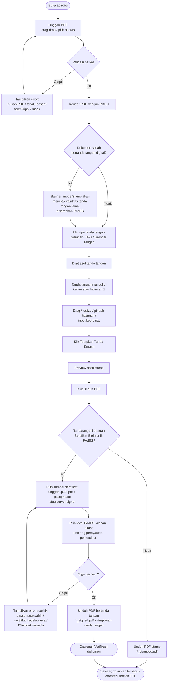
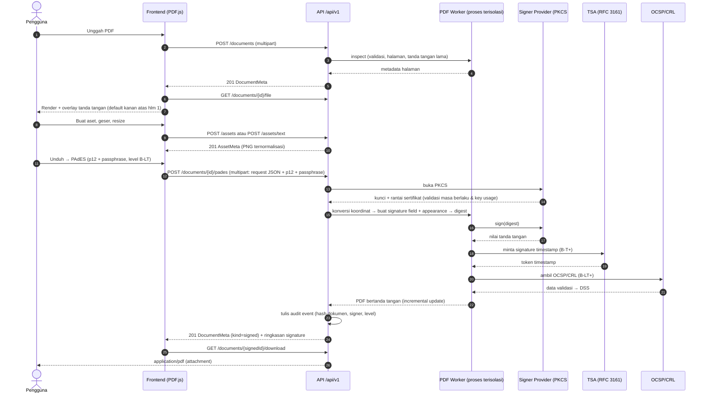
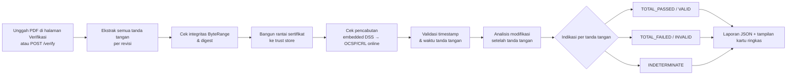
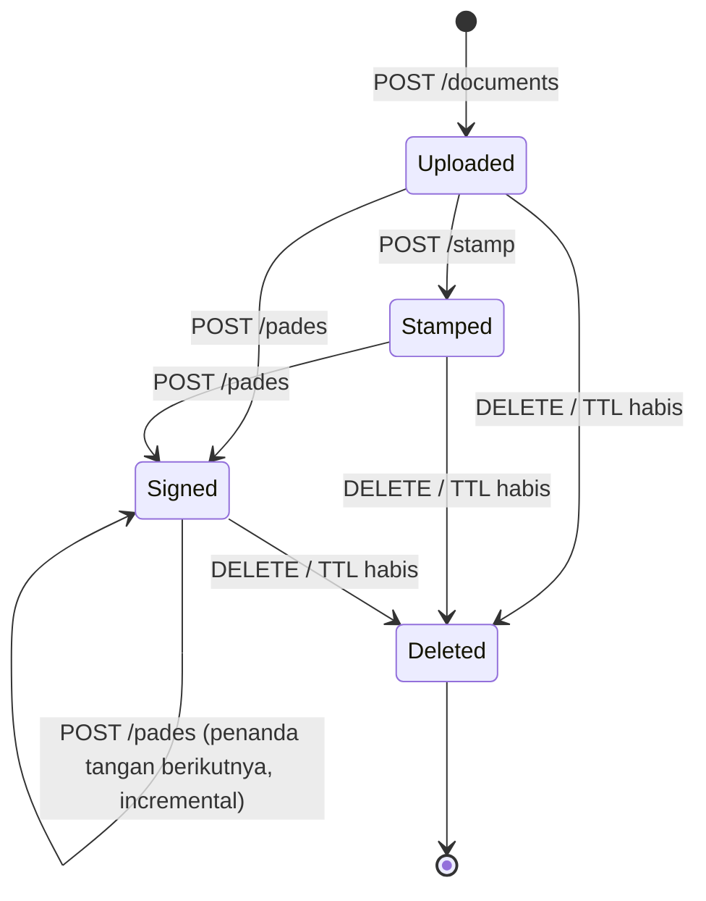
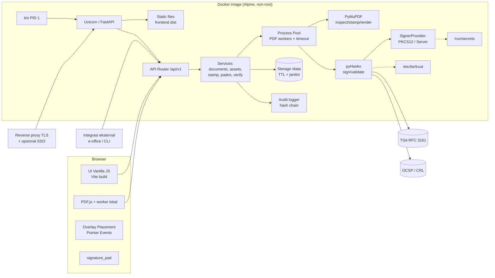
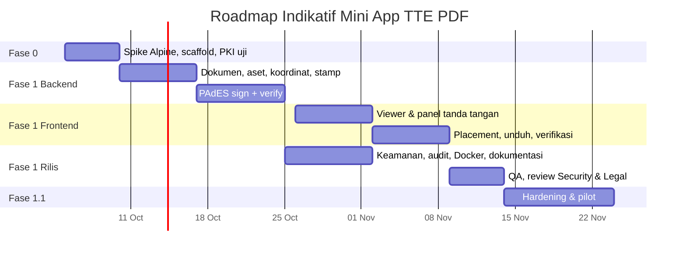

# PRD — Mini App TTE PDF

| Atribut         | Nilai                                                                                       |
| --------------- | ------------------------------------------------------------------------------------------- |
| Nama produk     | Mini App TTE PDF (kode: `tte-pdf`)                                                          |
| Versi dokumen   | 1.0                                                                                         |
| Tanggal         | 26 September 2026                                                                           |
| Status          | Draft untuk review (Product, Engineering, Legal, Security)                                  |
| Pemilik dokumen | Senior Product Manager — Produk Dokumen Digital                                             |
| Dokumen terkait | [`docs/PLAN.md`](PLAN.md), [`docs/TODO.md`](TODO.md), [`prompts/`](../prompts/00-README.md) |

---

## Daftar Isi

1. [Ringkasan Eksekutif](#1-ringkasan-eksekutif)
2. [Latar Belakang & Tujuan Produk](#2-latar-belakang--tujuan-produk)
3. [Target Pengguna & Persona](#3-target-pengguna--persona)
4. [Ruang Lingkup](#4-ruang-lingkup)
5. [Definisi & Istilah](#5-definisi--istilah)
6. [User Journey / Alur Pengguna](#6-user-journey--alur-pengguna)
7. [Functional Requirements](#7-functional-requirements)
8. [Non-Functional Requirements](#8-non-functional-requirements)
9. [Arsitektur Teknis & Rekomendasi Stack](#9-arsitektur-teknis--rekomendasi-stack)
10. [UI/UX Requirements](#10-uiux-requirements)
11. [Aspek Legal & Kepatuhan](#11-aspek-legal--kepatuhan)
12. [Metrik Keberhasilan](#12-metrik-keberhasilan)
13. [Risiko & Mitigasi](#13-risiko--mitigasi)
14. [Roadmap & Prioritas](#14-roadmap--prioritas)
15. [Asumsi & Dependensi](#15-asumsi--dependensi)
16. [Lampiran](#16-lampiran)
17. [Checklist Implementasi MVP](#17-checklist-implementasi-mvp)

---

## 1. Ringkasan Eksekutif

**Mini App TTE PDF** adalah aplikasi web ringan untuk membubuhkan tanda tangan pada dokumen PDF langsung dari browser. Pengguna mengunggah PDF, membuat tanda tangan (gambar, teks, atau goresan tangan), menempatkannya dengan drag-and-drop dan resize, lalu mengunduh PDF hasil — **sebagai stamp visual** atau **sebagai dokumen bertanda tangan digital PAdES** menggunakan Sertifikat Elektronik dari PSrE.

Pembeda utama produk:

| Pilar                    | Deskripsi                                                                                                                                                      |
| ------------------------ | -------------------------------------------------------------------------------------------------------------------------------------------------------------- |
| **Dua mode sejak MVP**   | _Stamp_ (visual, cepat, internal) dan _PAdES_ (kriptografis, berkekuatan hukum bila memakai sertifikat PSrE Indonesia).                                        |
| **Sign & Verify**        | PAdES Baseline B-B, B-T, B-LT (Must) dan B-LTA (Should), plus verifikasi tanda tangan dengan laporan terstruktur.                                              |
| **API-first**            | Seluruh alur (upload → preview → stamp/sign → verify → download) tersedia sebagai REST API berversi (`/api/v1`) yang dipakai frontend dan integrasi eksternal. |
| **Deploy ringan & aman** | Satu Docker image multi-stage berbasis **Alpine Linux**, non-root, read-only filesystem, target ≤ 120 MB (terkompresi), siap ≤ 5 detik.                        |
| **Privasi by default**   | Dokumen disimpan sementara (TTL default 30 menit), kunci privat PKCS#12 hanya diproses di memori dan tidak pernah disimpan atau dicatat di log.                |

Rekomendasi stack: **Python 3.13 + FastAPI + pyHanko (PAdES) + PyMuPDF (stamp)** di backend, **JavaScript (Vite) + PDF.js + signature_pad** di frontend, dikemas dalam image `python:3.13-alpine3.24`.

Target MVP: **8 minggu** (1 minggu spike + 7 minggu build), dilanjutkan hardening 2 minggu sebelum rilis produksi.

---

## 2. Latar Belakang & Tujuan Produk

### 2.1 Latar Belakang

- Organisasi masih menandatangani dokumen dengan pola _print → tanda tangan basah → scan_, yang memakan waktu 15–60 menit per dokumen, boros kertas, dan menghasilkan dokumen yang mudah dipalsukan.
- Banyak pengguna menempelkan gambar tanda tangan memakai editor PDF umum. Hasilnya **tidak dapat diverifikasi**, tidak mendeteksi perubahan dokumen, dan tidak memiliki kekuatan pembuktian yang kuat.
- UU ITE dan PP 71/2019 memberi kekuatan hukum pada Tanda Tangan Elektronik (TTE); TTE tersertifikasi yang memakai Sertifikat Elektronik dari PSrE Indonesia memiliki kekuatan pembuktian tertinggi. Namun solusi komersial umumnya berupa platform SaaS berlangganan yang mengharuskan dokumen diunggah ke pihak ketiga.
- Ada kebutuhan akan **aplikasi mini yang dapat di-_self-host_** (on-premise/private cloud), ringan, dan menyediakan API untuk sistem internal seperti e-office, HRIS, dan procurement.

### 2.2 Pernyataan Masalah

> Pengguna membutuhkan cara yang cepat, sederhana, dan dapat dipertanggungjawabkan secara hukum untuk menandatangani PDF, tanpa harus mengirim dokumen ke layanan pihak ketiga dan tanpa keahlian teknis kriptografi.

### 2.3 Tujuan Produk

| ID  | Tujuan                                                             | Indikator (lihat §12)                                                                    |
| --- | ------------------------------------------------------------------ | ---------------------------------------------------------------------------------------- |
| G-1 | Memangkas waktu penandatanganan dokumen dari menit ke detik.       | Median waktu upload→unduh ≤ 60 detik (stamp), ≤ 90 detik (PAdES).                        |
| G-2 | Menyediakan TTE yang sah dan dapat diverifikasi (PAdES) sejak MVP. | 100% dokumen PAdES lolos verifikasi internal dan validator pihak ketiga pada korpus uji. |
| G-3 | Menyediakan API TTE/TTD yang dapat diintegrasikan sistem lain.     | ≥ 2 sistem internal terintegrasi dalam 3 bulan setelah rilis.                            |
| G-4 | Deployment sederhana, ringan, dan aman.                            | Image ≤ 120 MB terkompresi, 0 CVE High/Critical yang _fixable_, siap ≤ 5 detik.          |
| G-5 | Menjaga privasi dan kerahasiaan dokumen.                           | 0 insiden kebocoran; dokumen terhapus otomatis sesuai TTL.                               |

### 2.4 Non-Tujuan (MVP)

- Bukan platform workflow persetujuan multi-pihak (routing, reminder, dashboard approval).
- Bukan penerbit sertifikat (bukan CA/PSrE) dan tidak melakukan verifikasi identitas (e-KYC).
- Bukan editor PDF (tidak mengubah teks/isi dokumen, tidak menyediakan OCR).
- Tidak menyediakan penyimpanan dokumen permanen (document management system).

---

## 3. Target Pengguna & Persona

### 3.1 Segmen

1. **Pengguna akhir internal organisasi** — staf, manajer, pejabat yang menandatangani memo, surat, SK, kontrak, berita acara.
2. **Tim Legal/Compliance** — memverifikasi keabsahan tanda tangan dan menelusuri audit trail.
3. **Developer/Integrator** — mengintegrasikan fungsi TTE ke sistem internal melalui API.
4. **DevOps/SysAdmin** — men-_deploy_, mengonfigurasi sertifikat/TSA/trust store, dan memantau layanan.

### 3.2 Persona

| Persona                      | Profil                                                                          | Kebutuhan Utama                                                                              | Pain Point                                                    | Mode Dominan                           |
| ---------------------------- | ------------------------------------------------------------------------------- | -------------------------------------------------------------------------------------------- | ------------------------------------------------------------- | -------------------------------------- |
| **Rina — Staf Sekretariat**  | 28 th, mengelola 20–40 surat/hari, terbiasa dengan aplikasi perkantoran.        | Tanda tangan cepat, posisi rapi, sekali klik.                                                | Print-scan lambat; editor PDF berbayar/rumit.                 | Stamp (gambar/teks)                    |
| **Pak Budi — Kepala Divisi** | 45 th, menandatangani kontrak dan SK, memiliki sertifikat elektronik dari PSrE. | Tanda tangan sah secara hukum tanpa proses rumit; tampilan tetap berupa tanda tangan visual. | Aplikasi PSrE terpisah; bingung mengenai level PAdES.         | PAdES (B-T/B-LT) + gambar tanda tangan |
| **Sari — Legal Officer**     | 35 th, memeriksa keabsahan dokumen masuk/keluar.                                | Laporan verifikasi yang jelas: siapa, kapan, apakah dokumen diubah, apakah sertifikat valid. | Validator sulit dibaca; tidak ada jejak audit.                | Verify + audit                         |
| **Andi — Backend Developer** | 30 th, membangun e-office internal.                                             | REST API terdokumentasi (OpenAPI), contoh `curl`, kode error konsisten, dan opsi CLI.        | API vendor tertutup dan mahal; dokumen harus keluar jaringan. | API stamp/PAdES/verify                 |
| **Dimas — DevOps Engineer**  | 32 th, mengelola cluster on-premise.                                            | Image kecil, non-root, konfigurasi via environment variable/secret, health check, log JSON.  | Image besar dan rentan CVE; dependency native sulit.          | Docker Alpine                          |

---

## 4. Ruang Lingkup

### 4.1 MVP (Fase 1)

| Area                | Termasuk MVP                                                                                                                                                                                                                                                                            |
| ------------------- | --------------------------------------------------------------------------------------------------------------------------------------------------------------------------------------------------------------------------------------------------------------------------------------- |
| Dokumen             | Upload PDF (≤ 20 MB, ≤ 200 halaman, dapat dikonfigurasi), inspeksi metadata, render di browser, hapus manual & otomatis (TTL).                                                                                                                                                          |
| Tanda tangan visual | Tipe **Gambar** (PNG/JPG), **Teks** (nama, jabatan, baris opsional), **Gambar Tangan** (canvas).                                                                                                                                                                                        |
| Penempatan          | Posisi default **kanan atas halaman pertama**, drag-and-drop, resize (dengan kunci rasio), pindah halaman, input koordinat numerik, navigasi keyboard.                                                                                                                                  |
| Mode Stamp          | Menerapkan tanda tangan visual ke konten halaman (_flatten_) dan mengunduh PDF.                                                                                                                                                                                                         |
| **Mode PAdES**      | **Sign** PAdES Baseline **B-B, B-T, B-LT** (Must) dan **B-LTA** (Should); tampilan visual sebagai _signature widget appearance_; sumber kunci **PKCS#12 upload** dan **server signer (segel organisasi)**; **Verify** dengan laporan terstruktur; trust store yang dapat dikonfigurasi. |
| API                 | REST API `/api/v1` untuk seluruh alur, dokumentasi OpenAPI (Swagger UI), format error RFC 9457, autentikasi API key.                                                                                                                                                                    |
| Keamanan & audit    | Audit trail JSON (tamper-evident _hash chain_), rate limiting, security headers/CSP, isolasi proses PDF, batas sumber daya.                                                                                                                                                             |
| **Deployment**      | **Docker image multi-stage berbasis Alpine Linux**, non-root, read-only FS, healthcheck, `docker-compose.yml`, multi-arch (amd64 wajib; arm64 lihat R-02).                                                                                                                              |

### 4.2 Fase Lanjutan

| Fase                              | Cakupan                                                                                                                                                                                                                                                                          |
| --------------------------------- | -------------------------------------------------------------------------------------------------------------------------------------------------------------------------------------------------------------------------------------------------------------------------------- |
| **Fase 1.1 — Hardening** (Should) | Multi-placement (paraf di beberapa halaman), thumbnail halaman, CLI `tte`, preview raster server-side, enkripsi at-rest, metrik Prometheus, mode autentikasi `proxy` (SSO gateway), sertifikasi dokumen (DocMDP), Idempotency-Key.                                               |
| **Fase 2 — Integrasi PSrE**       | Remote signing ke PSrE (API PSrE / Cloud Signature Consortium API) dengan pola _hash-then-sign_; PKCS#11/HSM; OIDC SSO; QR code verifikasi pada stamp; multi-penanda tangan berurutan dengan undangan; integrasi e-Meterai; enkripsi PDF (AES-256) berkata sandi; batch signing. |
| **Fase 3 — Skala & Workflow**     | Workflow persetujuan, template posisi tanda tangan, PWA/mobile, dashboard analitik, multi-tenant, penyimpanan terkelola opsional, portal verifikasi publik.                                                                                                                      |

### 4.3 Di Luar Lingkup (Won't — MVP)

- Penerbitan sertifikat, e-KYC, dan registrasi pengguna ke PSrE.
- Penandatanganan di sisi klien (kunci di perangkat pengguna melalui token USB/WebCrypto) — dievaluasi di Fase 3.
- Pengubahan isi PDF, OCR, konversi format (DOCX→PDF).
- Penyimpanan dokumen permanen dan pencarian arsip.

---

## 5. Definisi & Istilah

### 5.1 Glosarium

| Istilah                              | Definisi                                                                                                                                                                                                                                                              |
| ------------------------------------ | --------------------------------------------------------------------------------------------------------------------------------------------------------------------------------------------------------------------------------------------------------------------- |
| **TTE (Tanda Tangan Elektronik)**    | Tanda tangan berupa informasi elektronik yang dilekatkan/terasosiasi dengan informasi elektronik lain dan digunakan sebagai alat verifikasi dan autentikasi (UU ITE Pasal 1).                                                                                         |
| **TTE Tersertifikasi**               | TTE yang memakai Sertifikat Elektronik dari **PSrE Indonesia** dan dibuat dengan perangkat pembuat TTE tersertifikasi (PP 71/2019).                                                                                                                                   |
| **TTE Tidak Tersertifikasi**         | TTE yang dibuat tanpa jasa PSrE Indonesia (mis. sertifikat CA internal/self-signed).                                                                                                                                                                                  |
| **PSrE**                             | Penyelenggara Sertifikasi Elektronik; badan hukum yang menerbitkan dan mengaudit Sertifikat Elektronik. PSrE Indonesia berinduk ke **Root CA Indonesia** yang dikelola Kementerian (Kominfo, kini Komdigi). Contoh: BSrE–BSSN, Peruri, Privy, VIDA, Digisign, Tilaka. |
| **Sertifikat Elektronik**            | Sertifikat X.509 yang memuat identitas pemilik dan kunci publik, diterbitkan PSrE.                                                                                                                                                                                    |
| **PKCS#12 (.p12/.pfx)**              | Format berkas yang membungkus kunci privat dan rantai sertifikat, dilindungi _passphrase_.                                                                                                                                                                            |
| **CMS / CAdES**                      | Cryptographic Message Syntax (RFC 5652) dan profil ETSI-nya; struktur data tanda tangan yang disematkan di PDF.                                                                                                                                                       |
| **PAdES**                            | _PDF Advanced Electronic Signatures_ (ETSI EN 319 142). Profil tanda tangan digital untuk PDF (SubFilter `ETSI.CAdES.detached`).                                                                                                                                      |
| **PAdES B-B**                        | Level _Basic_: tanda tangan + sertifikat penanda tangan.                                                                                                                                                                                                              |
| **PAdES B-T**                        | B-B + **timestamp** tepercaya dari TSA (RFC 3161), membuktikan waktu penandatanganan.                                                                                                                                                                                 |
| **PAdES B-LT**                       | B-T + **data validasi** (rantai sertifikat, OCSP/CRL) di **DSS**, agar dapat divalidasi jangka panjang (LTV).                                                                                                                                                         |
| **PAdES B-LTA**                      | B-LT + **document timestamp** berkala untuk menjaga validitas setelah algoritma/sertifikat kedaluwarsa.                                                                                                                                                               |
| **TSA**                              | _Time-Stamping Authority_ yang memberikan cap waktu tepercaya.                                                                                                                                                                                                        |
| **OCSP / CRL**                       | Mekanisme pengecekan status pencabutan sertifikat (RFC 6960 / RFC 5280).                                                                                                                                                                                              |
| **DSS**                              | _Document Security Store_; kamus PDF tempat menyimpan data validasi (sertifikat, OCSP, CRL).                                                                                                                                                                          |
| **LTV**                              | _Long-Term Validation_; kemampuan memvalidasi tanda tangan bertahun-tahun kemudian.                                                                                                                                                                                   |
| **Incremental update**               | Penambahan revisi baru di akhir berkas PDF tanpa mengubah byte revisi sebelumnya; wajib untuk menjaga tanda tangan lama tetap valid.                                                                                                                                  |
| **ByteRange**                        | Rentang byte PDF yang dicakup _digest_ tanda tangan.                                                                                                                                                                                                                  |
| **DocMDP**                           | _Modification Detection and Prevention_; aturan perubahan yang diizinkan setelah _certification signature_.                                                                                                                                                           |
| **Stamp / Image Signature**          | Gambar/teks tanda tangan yang ditempelkan ke konten halaman PDF. Tidak mengandung kriptografi.                                                                                                                                                                        |
| **Flatten**                          | Menyatukan objek visual ke _content stream_ halaman sehingga menjadi bagian permanen halaman.                                                                                                                                                                         |
| **Signature widget / appearance**    | Anotasi visual milik _signature field_ PDF. Pada mode PAdES, tampilan tanda tangan dirender sebagai _appearance stream_ widget ini.                                                                                                                                   |
| **Trust anchor / trust store**       | Sertifikat root yang dipercaya validator (mis. Root CA Indonesia).                                                                                                                                                                                                    |
| **Server signer / segel elektronik** | Kunci milik organisasi yang disimpan di server (secret) untuk menandatangani atas nama organisasi.                                                                                                                                                                    |
| **PDF user space / pt**              | Sistem koordinat PDF: satuan _point_ (1/72 inci), titik asal di **kiri-bawah**.                                                                                                                                                                                       |
| **MediaBox / CropBox / Rotate**      | Kotak halaman fisik, area halaman yang ditampilkan, dan rotasi tampilan halaman (0/90/180/270, searah jarum jam).                                                                                                                                                     |
| **Non-repudiasi**                    | Penanda tangan tidak dapat menyangkal telah menandatangani, karena hanya pemilik kunci privat yang dapat membuat tanda tangan tersebut.                                                                                                                               |
| **e-Meterai**                        | Meterai elektronik (UU 10/2020 tentang Bea Meterai); di luar lingkup MVP.                                                                                                                                                                                             |

### 5.2 Stamp vs PAdES

| Aspek                      | Stamp / Image Signature                                    | Digital Signature / PAdES                                                                                        |
| -------------------------- | ---------------------------------------------------------- | ---------------------------------------------------------------------------------------------------------------- |
| Hakikat                    | Representasi visual (gambar/teks) di halaman.              | Tanda tangan kriptografis (hash dokumen + kunci privat) yang disematkan di PDF, dengan tampilan visual opsional. |
| Integritas dokumen         | Tidak ada; perubahan dokumen tidak terdeteksi.             | Ada; setiap perubahan byte setelah tanda tangan terdeteksi.                                                      |
| Autentikasi penanda tangan | Tidak ada; siapa pun dapat menyalin gambar.                | Ada; identitas terikat pada sertifikat X.509.                                                                    |
| Non-repudiasi              | Tidak ada.                                                 | Ada, selama kunci privat hanya dikuasai penanda tangan.                                                          |
| Bukti waktu                | Tidak ada (hanya teks).                                    | Ada (B-T ke atas, melalui TSA).                                                                                  |
| Validasi jangka panjang    | Tidak relevan.                                             | B-LT/B-LTA.                                                                                                      |
| Kekuatan hukum             | Lemah; bernilai sebagai bukti permulaan/pendukung.         | Sah (Pasal 11 UU ITE); **tersertifikasi** bila memakai sertifikat PSrE Indonesia.                                |
| Verifikasi                 | Visual saja.                                               | Otomatis via aplikasi ini, Adobe Acrobat/Reader, validator lain.                                                 |
| Prasyarat                  | Tidak ada.                                                 | Sertifikat elektronik (PKCS#12/server signer); TSA untuk B-T; akses OCSP/CRL untuk B-LT.                         |
| Contoh penggunaan          | Memo internal, draf, paraf non-kritis, dokumen informatif. | Kontrak, SK, berita acara, dokumen eksternal, dokumen yang dapat menjadi alat bukti.                             |

> **Catatan istilah.** Opsi "_Encrypt TTE Certificate_" pada kebutuhan awal diartikan sebagai **menandatangani secara digital (PAdES) dengan Sertifikat Elektronik**. Tanda tangan digital _bukan_ enkripsi dokumen: isi PDF tetap dapat dibaca siapa pun; yang dijamin adalah integritas, autentikasi, dan non-repudiasi. Enkripsi PDF berkata sandi (kerahasiaan) dijadwalkan di Fase 2. UI menggunakan label **"Tandatangani dengan Sertifikat Elektronik (PAdES)"**.

---

## 6. User Journey / Alur Pengguna

### 6.1 Alur Utama



### 6.2 Sequence — Penandatanganan PAdES



### 6.3 Alur Verifikasi



### 6.4 Siklus Hidup Dokumen



Setiap hasil (stamped/signed) adalah **dokumen turunan** dengan `id` baru dan `parent_id` ke dokumen asal, sehingga dapat diunduh, diverifikasi, atau ditandatangani lagi melalui endpoint yang sama.

---

## 7. Functional Requirements

Prioritas memakai **MoSCoW**: **M** = Must, **S** = Should, **C** = Could, **W** = Won't (MVP).

### 7.1 Ringkasan Fitur

| ID    | Fitur                                         | Prioritas | Fase                  |
| ----- | --------------------------------------------- | --------- | --------------------- |
| FR-01 | Upload PDF                                    | M         | MVP                   |
| FR-02 | Render PDF di browser                         | M         | MVP                   |
| FR-03 | Pilih mode & tipe tanda tangan                | M         | MVP                   |
| FR-04 | Buat tanda tangan Gambar                      | M         | MVP                   |
| FR-05 | Buat tanda tangan Teks                        | M         | MVP                   |
| FR-06 | Buat tanda tangan Gambar Tangan               | M         | MVP                   |
| FR-07 | Posisi default kanan atas halaman pertama     | M         | MVP                   |
| FR-08 | Drag & drop penempatan                        | M         | MVP                   |
| FR-09 | Resize penempatan                             | M         | MVP                   |
| FR-10 | Terapkan tanda tangan (mode Stamp)            | M         | MVP                   |
| FR-11 | Unduh PDF (dengan/tanpa PAdES)                | M         | MVP                   |
| FR-12 | PAdES Sign                                    | M         | MVP                   |
| FR-13 | PAdES Verify                                  | M         | MVP                   |
| FR-14 | Sumber sertifikat penanda tangan              | M         | MVP                   |
| FR-15 | Timestamp & LTV (B-T, B-LT; B-LTA)            | M / S     | MVP                   |
| FR-16 | REST API TTE/TTD                              | M         | MVP                   |
| FR-17 | Deployment Docker Alpine                      | M         | MVP                   |
| FR-18 | Audit trail                                   | M         | MVP                   |
| FR-19 | Penanganan dokumen yang sudah bertanda tangan | M         | MVP                   |
| FR-20 | Retensi & penghapusan dokumen                 | M         | MVP                   |
| FR-21 | Autentikasi API key & konfigurasi publik      | M         | MVP                   |
| FR-22 | Multi-placement & pindah halaman              | S         | MVP (1 placement = M) |
| FR-23 | Thumbnail & navigasi halaman                  | S         | 1.1                   |
| FR-24 | Preview raster server-side                    | S         | 1.1                   |
| FR-25 | CLI `tte`                                     | S         | 1.1                   |
| FR-26 | Certification signature (DocMDP)              | S         | 1.1                   |
| FR-27 | Undo/redo penempatan                          | C         | 1.1                   |
| FR-28 | QR code verifikasi pada tampilan              | C         | 2                     |
| FR-29 | Antarmuka bahasa Inggris                      | C         | 2                     |
| FR-30 | Remote signing PSrE / PKCS#11 / HSM           | W         | 2                     |

---

### FR-01 — Upload PDF

**Deskripsi.** Pengguna mengunggah satu berkas PDF melalui _drag-and-drop_ atau pemilih berkas. Backend memvalidasi berkas, menyimpannya sementara, dan mengembalikan metadata halaman.

**User story.** Sebagai _Rina_, saya ingin mengunggah PDF cukup dengan menyeretnya ke halaman, agar saya bisa segera menandatangani.

**Acceptance criteria.**

1. Mendukung drag-and-drop dan tombol "Pilih PDF"; hanya satu berkas per sesi editor.
2. Validasi di frontend (ekstensi `.pdf`, ukuran) **dan** di backend (magic bytes `%PDF-`, MIME, ukuran, jumlah halaman, dapat di-_parse_).
3. Batas default: **20 MB** (`TTE_MAX_UPLOAD_MB`) dan **200 halaman** (`TTE_MAX_PAGES`); melebihi batas → `413 FILE_TOO_LARGE` / `422 TOO_MANY_PAGES`.
4. PDF terenkripsi (memiliki _user password_) → `422 PDF_ENCRYPTED` dengan pesan yang jelas.
5. PDF rusak/tidak dapat di-_parse_ dalam batas waktu → `422 PDF_CORRUPT`.
6. Respons `201` memuat `id`, `sha256`, `page_count`, dan per halaman `width_pt`, `height_pt`, `rotation`, `crop_box`, serta `has_signatures`/`signature_count`.
7. Indikator progres unggah tampil untuk berkas > 1 MB.
8. Berkas disimpan dengan nama acak (ID ≥ 128 bit entropi); nama asli hanya disimpan sebagai metadata yang sudah disanitasi.

**Prioritas:** Must.

---

### FR-02 — Render PDF di Browser

**Deskripsi.** PDF dirender dengan **PDF.js** (worker di-_host_ lokal, tanpa CDN), mendukung scroll kontinu, zoom, dan rotasi halaman sesuai `/Rotate`.

**User story.** Sebagai pengguna, saya ingin melihat dokumen dengan jelas sebelum menandatangani agar saya yakin isi dan posisi tanda tangan sudah tepat.

**Acceptance criteria.**

1. Halaman pertama tampil ≤ 1,5 detik (p95) untuk PDF ≤ 10 MB di jaringan LAN.
2. Render bertahap (_lazy_) untuk halaman di luar viewport; memori tab tetap wajar untuk 200 halaman.
3. Kontrol zoom: _Fit width_, _Fit page_, 50%–200%, tombol +/−; posisi overlay tanda tangan tetap konsisten pada semua level zoom.
4. Halaman dengan `/Rotate` 90/180/270 dan `CropBox` ≠ `MediaBox` tampil sama seperti di Adobe Acrobat.
5. JavaScript di dalam PDF **tidak** dieksekusi (`enableScripting=false`, `isEvalSupported=false`).
6. Indikator halaman "Hal. X dari N" dan lompat ke halaman tertentu.

**Prioritas:** Must.

---

### FR-03 — Pilih Mode & Tipe Tanda Tangan

**Deskripsi.** Pengguna memilih **tipe visual** (Gambar, Teks, Gambar Tangan) di panel tanda tangan. **Mode** (Stamp atau PAdES) dipilih saat unduh. Keduanya dijelaskan secara singkat di UI.

**User story.** Sebagai _Pak Budi_, saya ingin memahami perbedaan stamp dan tanda tangan bersertifikat agar saya memilih yang sah untuk kontrak.

**Acceptance criteria.**

1. Panel memiliki tiga tab: **Gambar**, **Teks**, **Gambar Tangan**; tab terakhir yang dipakai diingat (per browser, `localStorage` opsional).
2. Dialog unduh menampilkan dua opsi dengan penjelasan satu kalimat dan tautan "Pelajari perbedaan" (ringkasan §5.2).
3. Opsi PAdES dinonaktifkan dengan penjelasan bila tidak ada sumber sertifikat yang tersedia (lihat FR-14).
4. Label mode Stamp mencantumkan keterangan "bukan TTE tersertifikasi".

**Prioritas:** Must.

---

### FR-04 — Tanda Tangan Gambar (PNG/JPG)

**Deskripsi.** Pengguna mengunggah gambar tanda tangan. Backend menyanitasi gambar (re-encode, hapus metadata EXIF) dan mengembalikan PNG RGBA ternormalisasi.

**User story.** Sebagai _Rina_, saya ingin memakai hasil scan tanda tangan atasan saya (dengan izin) agar hasilnya tampak seperti tanda tangan basah.

**Acceptance criteria.**

1. Format PNG/JPG; ukuran ≤ **2 MB** (`TTE_MAX_IMAGE_MB`); dimensi ≤ 4000×4000 px; magic bytes divalidasi.
2. Proteksi _decompression bomb_ (batas piksel); gambar di-_re-encode_ ke PNG; metadata/EXIF dibuang; orientasi EXIF diterapkan sebelum dibuang.
3. Transparansi PNG dipertahankan. **Could:** opsi "hapus latar putih" (ambang luminansi) untuk JPG hasil scan.
4. Respons `AssetMeta` berisi `id`, `width_px`, `height_px`, `aspect_ratio`, `sha256`.
5. Preview aset tampil di panel sebelum digunakan; tombol **Gunakan** menempatkan aset sesuai FR-07.

**Prioritas:** Must.

---

### FR-05 — Tanda Tangan Teks

**Deskripsi.** Pengguna mengetik nama, jabatan, dan baris opsional (mis. NIP/instansi). Backend merender teks menjadi PNG transparan beresolusi tinggi dengan font yang dibundel, sehingga preview identik dengan hasil (WYSIWYG).

**User story.** Sebagai _Rina_, saya ingin membuat tanda tangan teks "Rina Wijaya — Sekretaris" tanpa perlu gambar.

**Acceptance criteria.**

1. Field: Nama (wajib, ≤ 80 karakter), Jabatan (opsional, ≤ 80), Baris tambahan (opsional, ≤ 2 baris × 80).
2. Pilihan gaya font minimal 3 (Script/tulisan tangan, Sans, Serif) — font berlisensi OFL dibundel di image; warna: hitam, biru tua, atau hex kustom; perataan kiri/tengah/kanan.
3. Render di server (`POST /assets/text`) pada resolusi setara ≥ 300 DPI untuk ukuran default; hasil identik antara preview dan PDF.
4. Karakter Latin termasuk diakritik Indonesia/Eropa dirender dengan benar; karakter yang tidak didukung font → `422 UNSUPPORTED_CHARACTERS`.
5. Teks asli disimpan dalam audit event (bukan hanya gambar).

**Prioritas:** Must. _(Teks vektor native di PDF dijadwalkan Fase 2.)_

---

### FR-06 — Tanda Tangan Gambar Tangan (Canvas)

**Deskripsi.** Pengguna menggambar tanda tangan dengan mouse, pena, atau sentuhan di canvas (library `signature_pad`), lalu diekspor ke PNG transparan.

**User story.** Sebagai _Pak Budi_, saya ingin menggoreskan tanda tangan di tablet agar tampak personal.

**Acceptance criteria.**

1. Canvas responsif dengan resolusi _device-pixel-ratio aware_ (tidak buram di layar retina).
2. Kontrol: warna (hitam/biru), ketebalan (3 level), **Undo goresan**, **Bersihkan**.
3. Tombol **Gunakan** nonaktif bila canvas kosong.
4. Hasil di-_trim_ otomatis ke _bounding box_ goresan + padding 4%, lalu diunggah sebagai aset `type=drawn`.
5. Mendukung Pointer Events (mouse, pen, touch); halaman tidak ikut ter-scroll saat menggambar.

**Prioritas:** Must.

---

### FR-07 — Posisi Default Kanan Atas Halaman Pertama

**Deskripsi.** Saat aset digunakan, kotak tanda tangan otomatis muncul di **kanan atas halaman pertama** (orientasi tampilan).

**User story.** Sebagai pengguna, saya ingin tanda tangan langsung muncul di posisi yang masuk akal agar saya hanya perlu sedikit menggeser.

**Acceptance criteria.**

1. Halaman target: indeks 0 (halaman pertama) — mengikuti orientasi tampilan setelah `/Rotate`.
2. Margin: **36 pt** (0,5 inci) dari tepi atas dan kanan (`TTE_DEFAULT_MARGIN_PT`).
3. Lebar default: `clamp(25% × lebar halaman, 100 pt, 200 pt)`; tinggi = lebar ÷ `aspect_ratio` aset; bila tinggi > 30% tinggi halaman, skala turun proporsional.
4. Rumus (koordinat tampilan, asal kiri-atas, satuan pt): `x = pageW − margin − w`, `y = margin`.
5. Halaman pertama di-_scroll_ ke viewport dan kotak diberi fokus serta _highlight_ singkat (≤ 1 detik).
6. Bila API dipanggil tanpa `rect`, backend menerapkan aturan default yang sama (satu sumber kebenaran; lihat Lampiran C).

**Prioritas:** Must.

---

### FR-08 — Drag & Drop Penempatan

**Deskripsi.** Kotak tanda tangan dapat digeser dengan mouse/sentuhan/keyboard di atas halaman.

**User story.** Sebagai pengguna, saya ingin menggeser tanda tangan ke atas garis "Hormat kami" agar posisinya tepat.

**Acceptance criteria.**

1. Implementasi berbasis **Pointer Events** (mouse, touch, pen) dengan `setPointerCapture`; 60 fps pada perangkat menengah.
2. Kotak tidak dapat keluar dari batas halaman (di-_clamp_).
3. Dapat dipindah ke halaman lain melalui kontrol "Halaman" di panel properti (Must) dan dengan drag lintas halaman (Should).
4. Keyboard: panah = 1 pt, Shift+panah = 10 pt, `Delete` = hapus, `Esc` = batal pilih; kotak dapat difokus (`tabindex=0`) dengan label ARIA.
5. Panel properti menampilkan X, Y, W, H (pt, asal kiri-atas) yang tersinkron dua arah dengan kotak.
6. Posisi disimpan sebagai **rasio relatif halaman** (0–1) sehingga tidak berubah saat zoom.

**Prioritas:** Must.

---

### FR-09 — Resize Penempatan

**Deskripsi.** Kotak dapat diubah ukurannya melalui _handle_ sudut/sisi.

**User story.** Sebagai pengguna, saya ingin memperkecil tanda tangan agar muat di kolom tanda tangan.

**Acceptance criteria.**

1. Empat _handle_ sudut (Must) dan empat _handle_ sisi (Should); ukuran _handle_ sentuh ≥ 24 px.
2. **Kunci rasio aspek aktif secara default**; dapat dinonaktifkan (toggle) atau dengan menahan Shift.
3. Ukuran minimum 24 × 12 pt; maksimum sebesar halaman; tidak dapat melewati batas halaman.
4. Resize juga dapat dilakukan lewat input W/H pada panel properti.
5. Kualitas gambar tetap tajam (aset beresolusi tinggi di-_scale_ ke bawah).

**Prioritas:** Must.

---

### FR-10 — Terapkan Tanda Tangan (Mode Stamp)

**Deskripsi.** Tombol **Terapkan Tanda Tangan** mengirim semua _placement_ ke backend, yang menempelkan aset ke konten halaman (flatten) dan menghasilkan dokumen turunan `kind=stamped`.

**User story.** Sebagai _Rina_, saya ingin menerapkan tanda tangan lalu melihat hasil akhirnya sebelum mengunduh.

**Acceptance criteria.**

1. Frontend mengirim `POST /api/v1/documents/{id}/stamp` dengan koordinat ternormalisasi (Lampiran C).
2. Selisih posisi hasil vs preview ≤ **1 pt** di semua kombinasi rotasi (0/90/180/270), CropBox berbeda, dan ukuran kertas (A4, F4, Letter, Legal) — diverifikasi dengan uji otomatis.
3. Aset tampil tegak sesuai orientasi tampilan halaman.
4. Konten asli halaman, tautan, dan form field tidak berubah (kecuali penambahan stamp).
5. Hasil dirender ulang di viewer (preview hasil) dengan label "Pratinjau hasil".
6. Operasi selesai ≤ 2 detik (p95) untuk PDF 20 halaman.
7. Bila dokumen sudah bertanda tangan digital, lihat FR-19.

**Prioritas:** Must.

---

### FR-11 — Unduh PDF (dengan/tanpa PAdES)

**Deskripsi.** Dialog **Unduh PDF** menawarkan dua opsi: (a) PDF stamp visual, atau (b) PDF bertanda tangan digital PAdES.

**User story.** Sebagai _Pak Budi_, saya ingin memilih apakah dokumen ditandatangani dengan sertifikat saat diunduh.

**Acceptance criteria.**

1. Opsi (a): mengunduh dokumen `stamped` dengan nama `<nama-asli>_stamped.pdf`.
2. Opsi (b): form sumber sertifikat (FR-14), level PAdES (default dari konfigurasi, mis. B-T), alasan, lokasi, kontak (opsional), dan **checkbox persetujuan** wajib: _"Saya menyatakan menandatangani dokumen ini secara sadar dan menyetujui isinya."_
3. Opsi (b) memanggil `POST /documents/{id}/pades` pada **dokumen asal** (bukan hasil flatten) dengan placement utama sebagai _signature widget_ dan placement lain sebagai stamp pendahulu (FR-22), lalu mengunduh `<nama-asli>_signed.pdf`.
4. Setelah unduh, tampil ringkasan: penanda tangan (CN), penerbit, waktu (TSA bila ada), level PAdES, SHA-256 dokumen.
5. Header respons: `Content-Type: application/pdf`, `Content-Disposition: attachment; filename*=UTF-8''...`, `Cache-Control: no-store`.

**Prioritas:** Must.

---

### FR-12 — PAdES Sign

**Deskripsi.** Backend menandatangani PDF sesuai **ETSI EN 319 142-1 (PAdES Baseline)** memakai **pyHanko**, dengan tampilan visual yang dirender sebagai _appearance stream_ dari _signature widget_, disimpan sebagai **incremental update**.

**User story.** Sebagai _Pak Budi_, saya ingin kontrak yang saya tanda tangani terverifikasi valid di Adobe Acrobat dan tidak dapat diubah tanpa terdeteksi.

**Acceptance criteria.**

1. SubFilter `ETSI.CAdES.detached`; digest **SHA-256** (minimal; SHA-384/512 dapat dikonfigurasi); kunci **RSA ≥ 2048** atau **ECDSA P-256/P-384**.
2. Atribut CAdES `signing-certificate-v2` disertakan; tidak ada atribut `signingTime` yang bertentangan dengan timestamp.
3. **Visible signature:** field baru (default `Signature{n}`) pada halaman dan rect hasil konversi koordinat; appearance = aset tanda tangan + (opsional) teks detail: nama penanda tangan, waktu, alasan. **Invisible signature** didukung bila `placement = null`.
4. Metadata `/Reason`, `/Location`, `/ContactInfo`, `/Name` terisi dari request/sertifikat.
5. Penyimpanan selalu _incremental_; tanda tangan sebelumnya tetap valid (diuji dengan dokumen yang sudah bertanda tangan).
6. Validasi pra-tanda tangan: sertifikat belum kedaluwarsa/berlaku, _key usage_ mengizinkan `digitalSignature`/`nonRepudiation`, rantai sertifikat lengkap (bila tidak, pakai sertifikat tambahan dari trust store) → bila gagal, error spesifik (`CERT_EXPIRED`, `CERT_NOT_YET_VALID`, `CERT_KEY_USAGE`).
7. Dokumen hasil lolos: (a) verifikasi internal FR-13 `TOTAL_PASSED` dengan trust store uji; (b) `pyhanko sign validate`; (c) Adobe Acrobat Reader menampilkan "Signature is valid" setelah root uji dipercaya (checklist manual QA).
8. Waktu proses B-B ≤ 1,5 detik (p95) untuk PDF 20 halaman, di luar latensi TSA/OCSP.
9. Arsitektur signer memakai antarmuka `SignerProvider` dan pola _digest → sign → embed_ agar remote signing (Fase 2) dapat ditambahkan tanpa mengubah API.

**Prioritas:** Must.

---

### FR-13 — PAdES Verify

**Deskripsi.** Memverifikasi semua tanda tangan di PDF dan menghasilkan laporan terstruktur (JSON) serta tampilan ringkas di UI.

**User story.** Sebagai _Sari_, saya ingin mengetahui apakah dokumen masih utuh, siapa penandatangannya, kapan ditandatangani, dan apakah sertifikatnya tepercaya.

**Acceptance criteria.**

1. Endpoint `POST /api/v1/verify` (unggah berkas) dan `GET /api/v1/documents/{id}/signatures` (dokumen yang sudah diunggah).
2. Per tanda tangan melaporkan: `field_name`, halaman & rect, identitas penanda tangan (CN, O, email, serial, issuer, masa berlaku), `integrity.intact`, `coverage` (ENTIRE_FILE / ENTIRE_REVISION / PARTIAL), `modifications` setelah tanda tangan, `trust` (trusted + rantai), `revocation` (GOOD/REVOKED/UNKNOWN + sumber), `timestamp` (ada/valid/waktu/TSA), `pades_level` terdeteksi, `reason`, `location`.
3. Indikasi mengikuti terminologi ETSI EN 319 102-1: `TOTAL_PASSED`, `TOTAL_FAILED`, `INDETERMINATE`, dengan `sub_indication` dan pesan berbahasa Indonesia.
4. Ringkasan dokumen: `VALID` (semua lolos), `INVALID` (ada yang gagal), `INDETERMINATE`, atau `NO_SIGNATURE`.
5. Trust store dari direktori `TTE_TRUST_DIR` (PEM/DER), opsional ditambah trust store sistem (`TTE_TRUST_SYSTEM=true`).
6. Pengambilan OCSP/CRL online dapat dimatikan (`TTE_VALIDATION_FETCH=false`) untuk lingkungan _air-gapped_; hasil menjadi `INDETERMINATE` bila data validasi tidak tersedia.
7. Korpus uji wajib terdeteksi benar: valid, dokumen dimodifikasi setelah tanda tangan, sertifikat dicabut, sertifikat kedaluwarsa, root tidak dipercaya, multi-tanda tangan, dokumen tanpa tanda tangan.
8. `POST /verify` tidak menyimpan berkas setelah respons (kecuali `store=true`).

**Prioritas:** Must.

---

### FR-14 — Sumber Sertifikat Penanda Tangan

**Deskripsi.** MVP mendukung dua _provider_: **PKCS#12 upload** (per operasi) dan **server signer** (segel organisasi dari Docker secret).

**User story.** Sebagai _Pak Budi_, saya ingin memakai berkas .p12 dari PSrE saya; sebagai _Dimas_, saya ingin mengonfigurasi segel elektronik organisasi untuk dokumen otomatis.

**Acceptance criteria.**

1. **PKCS#12:** `.p12/.pfx` ≤ 100 KB; dibuka **hanya di memori**; berkas dan _passphrase_ tidak pernah ditulis ke disk, log, audit, atau pesan error; referensi dilepas segera setelah operasi.
2. Passphrase salah → `422 PKCS12_BAD_PASSPHRASE`; 5 kegagalan/15 menit per IP → `429 TOO_MANY_ATTEMPTS`.
3. **Server signer:** dikonfigurasi dengan `TTE_SERVER_SIGNER_P12_FILE` + `TTE_SERVER_SIGNER_PASSPHRASE_FILE` (Docker secret); hanya dapat dipakai oleh API key dengan scope `sign:server` → selain itu `403 SERVER_SIGNER_FORBIDDEN`.
4. `GET /api/v1/config` menunjukkan `server_signer_available` tanpa membocorkan detail sertifikat selain CN & masa berlaku.
5. UI memperingatkan: _"Berkas .p12 berisi kunci privat Anda. Berkas diproses sementara di memori server dan tidak disimpan."_

**Prioritas:** Must.

---

### FR-15 — Timestamp & LTV

**Deskripsi.** Mendukung level **B-T** (timestamp TSA), **B-LT** (DSS + OCSP/CRL), dan **B-LTA** (document timestamp).

**User story.** Sebagai _Sari_, saya ingin tanda tangan tetap dapat divalidasi bertahun-tahun setelah sertifikat penanda tangan kedaluwarsa.

**Acceptance criteria.**

1. TSA dikonfigurasi via `TTE_TSA_URL` (+ kredensial opsional dari secret); timeout 10 detik, 2 kali retry dengan backoff.
2. B-T: token timestamp tervalidasi dan menjadi `timestamp.time` di laporan verifikasi.
3. B-LT: DSS berisi rantai sertifikat + respons OCSP/CRL untuk sertifikat penanda tangan dan TSA.
4. B-LTA: document timestamp ditambahkan setelah DSS (Should).
5. Bila TSA/OCSP tidak tersedia → gagal eksplisit (`502 TSA_UNAVAILABLE` / `502 REVOCATION_UNAVAILABLE`); **tidak** turun level diam-diam. UI menawarkan opsi mencoba ulang atau memilih level lebih rendah secara sadar.
6. `TTE_ALLOWED_LEVELS` membatasi level yang boleh dipilih; `TTE_DEFAULT_LEVEL` menentukan default.

**Prioritas:** B-B, B-T, B-LT = Must; B-LTA = Should.

---

### FR-16 — REST API TTE/TTD

**Deskripsi.** Seluruh alur tersedia melalui REST API berversi `/api/v1`, JSON UTF-8, error format **RFC 9457 Problem Details**, dan dokumentasi OpenAPI 3.1.

**User story.** Sebagai _Andi_, saya ingin menandatangani dokumen dari e-office internal lewat API tanpa membuka UI.

**Acceptance criteria.**

1. Endpoint sesuai tabel §7.2 dan kontrak detail di Lampiran A.
2. OpenAPI tersedia di `/api/openapi.json`; Swagger UI di `/api/docs` (dapat dimatikan via `TTE_API_DOCS_ENABLED=false`).
3. Setiap respons memuat header `X-Request-ID` (diteruskan dari request bila ada).
4. Kode error stabil dan terdokumentasi (Lampiran A.4).
5. Contoh `curl` end-to-end untuk stamp, PAdES, dan verify di `docs/API.md`.
6. Perubahan yang _breaking_ hanya di versi baru (`/api/v2`).

**Prioritas:** Must.

#### 7.2 Spesifikasi Endpoint (ringkas)

| #   | Method | Path                                          | Deskripsi                                     | Auth*                         | Request                                                                | Response sukses                         |
| --- | ------ | --------------------------------------------- | --------------------------------------------- | ----------------------------- | ---------------------------------------------------------------------- | --------------------------------------- |
| 1   | GET    | `/api/v1/health/live`                         | Liveness                                      | —                             | —                                                                      | `200 {"status":"ok"}`                   |
| 2   | GET    | `/api/v1/health/ready`                        | Readiness (storage, worker pool, trust store) | —                             | —                                                                      | `200 {"status":"ready","checks":{...}}` |
| 3   | GET    | `/api/v1/config`                              | Konfigurasi publik (batas, level, fitur)      | —                             | —                                                                      | `200 PublicConfig`                      |
| 4   | POST   | `/api/v1/documents`                           | Unggah PDF                                    | `doc:write`                   | `multipart/form-data`: `file`                                          | `201 DocumentMeta`                      |
| 5   | GET    | `/api/v1/documents/{id}`                      | Metadata dokumen                              | `doc:read`                    | —                                                                      | `200 DocumentMeta`                      |
| 6   | GET    | `/api/v1/documents/{id}/file`                 | Berkas PDF (inline, untuk PDF.js)             | `doc:read`                    | —                                                                      | `200 application/pdf`                   |
| 7   | GET    | `/api/v1/documents/{id}/download`             | Berkas PDF (attachment)                       | `doc:read`                    | —                                                                      | `200 application/pdf`                   |
| 8   | GET    | `/api/v1/documents/{id}/pages/{page}/preview` | Raster PNG halaman (S)                        | `doc:read`                    | `?scale=1.0`                                                           | `200 image/png`                         |
| 9   | DELETE | `/api/v1/documents/{id}`                      | Hapus dokumen & turunannya                    | `doc:write`                   | —                                                                      | `204`                                   |
| 10  | POST   | `/api/v1/assets`                              | Unggah aset gambar / gambar tangan            | `doc:write`                   | `multipart`: `type`=`image`\|`drawn`, `file`                           | `201 AssetMeta`                         |
| 11  | POST   | `/api/v1/assets/text`                         | Render aset teks                              | `doc:write`                   | JSON `TextAssetRequest`                                                | `201 AssetMeta`                         |
| 12  | GET    | `/api/v1/assets/{id}`                         | Gambar aset (PNG)                             | `doc:read`                    | —                                                                      | `200 image/png`                         |
| 13  | DELETE | `/api/v1/assets/{id}`                         | Hapus aset                                    | `doc:write`                   | —                                                                      | `204`                                   |
| 14  | POST   | `/api/v1/documents/{id}/stamp`                | Terapkan stamp visual                         | `sign:stamp`                  | JSON `StampRequest`                                                    | `201 DocumentMeta` (kind=`stamped`)     |
| 15  | POST   | `/api/v1/documents/{id}/pades`                | Tanda tangan PAdES                            | `sign:pades` (+`sign:server`) | `multipart`: `request` (JSON `PadesRequest`), `pkcs12`?, `passphrase`? | `201 SignResult`                        |
| 16  | GET    | `/api/v1/documents/{id}/signatures`           | Verifikasi dokumen tersimpan                  | `verify`                      | —                                                                      | `200 VerificationReport`                |
| 17  | POST   | `/api/v1/verify`                              | Verifikasi berkas yang diunggah               | `verify`                      | `multipart`: `file`, `store`?                                          | `200 VerificationReport`                |
| 18  | GET    | `/api/openapi.json`, `/api/docs`              | Dokumentasi API                               | —                             | —                                                                      | `200`                                   |

\* Scope berlaku bila `TTE_AUTH_MODE=apikey`. Pada mode `none`, semua scope dianggap terpenuhi **kecuali** `sign:server`, yang selalu mewajibkan API key.

Kontrak skema lengkap (JSON), contoh, dan kode error ada di **Lampiran A**.

---

### FR-17 — Deployment via Docker Alpine

**Deskripsi.** Aplikasi (backend + frontend statis) dikemas sebagai **satu Docker image multi-stage berbasis Alpine Linux**.

**User story.** Sebagai _Dimas_, saya ingin menjalankan aplikasi dengan satu perintah `docker run`, dengan image kecil, aman, dan mudah dikonfigurasi.

**Acceptance criteria.**

1. Base runtime `python:3.13-alpine3.24` (atau rilis Alpine yang masih didukung), di-_pin_ dengan digest.
2. Multi-stage: `frontend-build` (Node Alpine) → `python-build` (venv + wheels) → `runtime` (tanpa compiler, tanpa cache pip, tanpa sumber frontend).
3. Berjalan sebagai **non-root** (UID/GID 10001), kompatibel dengan `--read-only`, `--cap-drop=ALL`, `--security-opt=no-new-privileges`.
4. `tini` sebagai PID 1; `HEALTHCHECK` ke `/api/v1/health/live`; port **8080**.
5. Ukuran image ≤ **120 MB terkompresi** (≤ 300 MB tidak terkompresi); gagal CI bila terlampaui.
6. Waktu siap (readiness 200) ≤ **5 detik** sejak `docker run` pada 2 vCPU.
7. Konfigurasi 100% via environment variable dan berkas secret (Lampiran B); tidak ada secret di image.
8. Tersedia `docker-compose.yml` contoh (dengan hardening) dan dokumentasi deploy.
9. Pemindaian Trivy/Grype: 0 kerentanan High/Critical yang _fixable_; SBOM (SPDX/CycloneDX) dihasilkan di CI.

**Prioritas:** Must.

---

### FR-18 — Audit Trail

**Deskripsi.** Setiap aksi penting dicatat sebagai _audit event_ terstruktur (JSON Lines) yang _tamper-evident_.

**User story.** Sebagai _Sari_, saya ingin menelusuri siapa menandatangani dokumen apa, kapan, dan dengan sertifikat apa.

**Acceptance criteria.**

1. Event: `document.uploaded`, `document.deleted`, `document.expired`, `asset.created`, `stamp.applied`, `pades.signed`, `pades.failed`, `verify.performed`, `document.downloaded`, `auth.failed`, `ratelimit.triggered`.
2. Field: `ts` (UTC ISO-8601), `event`, `request_id`, `actor` (api key id / user proxy / `anonymous`), `ip`, `user_agent`, `document_id`, `document_sha256` (sebelum & sesudah), `signer` (subject, serial, issuer untuk PAdES), `level`, `outcome`, `error_code`, `prev_hash`, `hash`.
3. `hash = SHA-256(prev_hash || canonical_json(event))` membentuk _hash chain_; utilitas `verify-audit` mendeteksi baris yang diubah/dihapus.
4. Sink: stdout (Must) dan berkas append-only `TTE_AUDIT_FILE` (Should).
5. **Tidak pernah** berisi isi dokumen, passphrase, kunci privat, atau gambar tanda tangan.

**Prioritas:** Must.

---

### FR-19 — Penanganan Dokumen yang Sudah Bertanda Tangan

**Deskripsi.** Sistem mendeteksi tanda tangan digital yang sudah ada dan mencegah tindakan yang merusak validitasnya tanpa persetujuan.

**User story.** Sebagai _Pak Budi_, saya ingin menjadi penanda tangan kedua tanpa merusak tanda tangan penanda tangan pertama.

**Acceptance criteria.**

1. `DocumentMeta.has_signatures` dan banner UI saat dokumen memiliki tanda tangan.
2. Mode Stamp pada dokumen bertanda tangan → `409 EXISTING_SIGNATURES` kecuali `options.allow_existing_signatures=true`; UI meminta konfirmasi eksplisit dengan peringatan.
3. Mode PAdES pada dokumen bertanda tangan → incremental; hanya placement utama yang diizinkan (placement tambahan → `409 EXTRA_STAMPS_NOT_ALLOWED`).
4. Setelah penanda tangan kedua, verifikasi menunjukkan dua tanda tangan `TOTAL_PASSED`.
5. Dokumen dengan certification signature DocMDP P=1 → `409 DOCMDP_LOCKED`.

**Prioritas:** Must.

---

### FR-20 — Retensi & Penghapusan Dokumen

**Deskripsi.** Dokumen, aset, dan hasil disimpan sementara lalu dihapus otomatis.

**User story.** Sebagai _Sari_, saya ingin memastikan dokumen rahasia tidak tertinggal di server.

**Acceptance criteria.**

1. TTL default **30 menit** sejak dibuat (`TTE_DOC_TTL_MINUTES`); `expires_at` dikembalikan di metadata.
2. _Janitor_ berkala (setiap 60 detik) menghapus berkas kedaluwarsa; akses ke dokumen kedaluwarsa → `404 DOCUMENT_NOT_FOUND` (tanpa membedakan "tidak ada" dan "kedaluwarsa").
3. `DELETE /documents/{id}` menghapus dokumen beserta semua turunan dan aset terkait.
4. Tombol "Hapus dokumen dari server" di UI dan penghapusan otomatis saat pengguna memulai dokumen baru.
5. Opsi `TTE_DELETE_AFTER_DOWNLOAD=true` menghapus hasil segera setelah unduhan berhasil.
6. Saat start, direktori data dibersihkan dari sisa berkas kedaluwarsa.

**Prioritas:** Must.

---

### FR-21 — Autentikasi API Key & Konfigurasi Publik

**Deskripsi.** Mode autentikasi dapat dikonfigurasi: `none` (jaringan internal tepercaya/dev) dan `apikey`. Mode `proxy` (identitas dari SSO gateway) adalah Should.

**User story.** Sebagai _Dimas_, saya ingin hanya sistem terdaftar yang dapat memakai API dan segel organisasi.

**Acceptance criteria.**

1. API key dikirim via header `X-API-Key`; disimpan sebagai hash (SHA-256 + salt) di berkas `TTE_API_KEYS_FILE` beserta `id`, `scopes`, `expires_at` opsional.
2. Scope: `doc:read`, `doc:write`, `sign:stamp`, `sign:pades`, `sign:server`, `verify`.
3. Kegagalan autentikasi → `401 UNAUTHORIZED`; kurang scope → `403 FORBIDDEN`; dicatat di audit.
4. Mode `apikey` di UI: pengguna memasukkan API key sekali per sesi (disimpan di `sessionStorage`).
5. Akses dokumen dibatasi pada pemilik: dokumen yang diunggah dengan API key A tidak dapat diakses API key B (`404`).
6. CORS default _same-origin_; origin tambahan via `TTE_CORS_ORIGINS`.

**Prioritas:** Must.

---

### FR-22 — Multi-Placement & Pindah Halaman

**Deskripsi.** Beberapa kotak tanda tangan/paraf pada satu atau beberapa halaman.

**User story.** Sebagai _Rina_, saya ingin menaruh paraf di setiap halaman kontrak dan tanda tangan penuh di halaman terakhir.

**Acceptance criteria.**

1. MVP (Must): **1 placement**, dapat dipindah ke halaman mana pun.
2. Should: hingga **20 placement** per dokumen; aksi "Duplikat ke semua halaman" (Could).
3. Pada mode PAdES, satu placement ditandai **utama** (menjadi signature widget); placement lain di-_stamp_ terlebih dahulu dalam operasi yang sama (hanya bila dokumen belum bertanda tangan; lihat FR-19).

**Prioritas:** Should (1 placement = Must).

---

### FR-23 s.d. FR-30 — Fitur Pendukung

| ID    | Fitur                          | Deskripsi & Acceptance Criteria Kunci                                                                                | Prioritas  |
| ----- | ------------------------------ | -------------------------------------------------------------------------------------------------------------------- | ---------- |
| FR-23 | Thumbnail & navigasi           | Sidebar thumbnail (render lazy, resolusi rendah); klik untuk lompat; indikator halaman yang memiliki placement.      | S          |
| FR-24 | Preview raster server-side     | `GET /documents/{id}/pages/{n}/preview?scale=` → PNG (maks. scale 3); untuk klien API tanpa PDF.js.                  | S          |
| FR-25 | CLI `tte`                      | `tte stamp`, `tte sign`, `tte verify` memanggil API (atau mode lokal); keluaran JSON; exit code non-zero bila gagal. | S          |
| FR-26 | Certification signature        | Opsi `certify: true` + `docmdp: 1\|2\|3` untuk tanda tangan pertama.                                                 | S          |
| FR-27 | Undo/redo                      | Riwayat 20 langkah untuk tambah/geser/resize/hapus placement (`Ctrl/Cmd+Z`, `Ctrl/Cmd+Shift+Z`).                     | C          |
| FR-28 | QR verifikasi                  | QR berisi URL verifikasi + hash dokumen pada appearance.                                                             | C (Fase 2) |
| FR-29 | Bahasa Inggris                 | i18n berbasis kamus string; deteksi `navigator.language`.                                                            | C (Fase 2) |
| FR-30 | Remote signing / PKCS#11 / HSM | Provider `RemotePsreProvider` (CSC API/API PSrE), `Pkcs11Provider`; kunci tidak pernah keluar dari HSM/PSrE.         | W (Fase 2) |

---

## 8. Non-Functional Requirements

### 8.1 Keamanan

| ID         | Requirement            | Target / Kriteria                                                                                                                                                                                                                                                                                                                                |
| ---------- | ---------------------- | ------------------------------------------------------------------------------------------------------------------------------------------------------------------------------------------------------------------------------------------------------------------------------------------------------------------------------------------------ |
| NFR-SEC-01 | Transport              | TLS 1.2+ wajib di produksi (terminasi di reverse proxy); header `Strict-Transport-Security` bila `TTE_HSTS=true`.                                                                                                                                                                                                                                |
| NFR-SEC-02 | Security headers       | `Content-Security-Policy: default-src 'self'; script-src 'self'; worker-src 'self' blob:; img-src 'self' data: blob:; style-src 'self'; object-src 'none'; frame-ancestors 'none'; base-uri 'none'`, `X-Content-Type-Options: nosniff`, `Referrer-Policy: no-referrer`, `Permissions-Policy` minimal, `Cross-Origin-Opener-Policy: same-origin`. |
| NFR-SEC-03 | Kunci privat           | PKCS#12 & passphrase hanya di memori; tidak pernah di log/disk/audit/traceback; body request tidak di-log.                                                                                                                                                                                                                                       |
| NFR-SEC-04 | Isolasi pemrosesan PDF | Operasi PDF (inspect, stamp, sign, verify, render) berjalan di _process pool_ terpisah dengan timeout per job (`TTE_JOB_TIMEOUT_SECONDS=30`) dan batas memori; crash worker tidak menjatuhkan API.                                                                                                                                               |
| NFR-SEC-05 | Validasi input         | Validasi skema ketat (Pydantic), batas ukuran di level server (body limit), magic bytes, batas jumlah halaman/placement, sanitasi nama berkas.                                                                                                                                                                                                   |
| NFR-SEC-06 | Rate limiting          | Per IP/API key: upload 30/menit, PAdES 10/menit, verify 30/menit, gagal passphrase 5/15 menit.                                                                                                                                                                                                                                                   |
| NFR-SEC-07 | Pencegahan IDOR        | ID dokumen acak ≥ 128 bit, kepemilikan per API key, respons `404` seragam.                                                                                                                                                                                                                                                                       |
| NFR-SEC-08 | Supply chain           | Lock file dengan hash (`uv.lock` / `requirements.txt --require-hashes`, `package-lock.json`), `npm ci --ignore-scripts`, SCA di CI, SBOM, penandatanganan image (cosign — Should).                                                                                                                                                               |
| NFR-SEC-09 | Kriptografi            | SHA-256+, RSA ≥ 2048, ECDSA P-256+; tolak SHA-1/MD5 untuk tanda tangan baru; laporkan algoritma lemah saat verifikasi.                                                                                                                                                                                                                           |
| NFR-SEC-10 | OWASP                  | Lolos OWASP ASVS L1 dan uji OWASP ZAP baseline tanpa temuan High.                                                                                                                                                                                                                                                                                |

### 8.2 Performa & Skalabilitas

| ID          | Metrik                           | Target (2 vCPU, 2 GB RAM, PDF 20 hlm/5 MB)                                                                             |
| ----------- | -------------------------------- | ---------------------------------------------------------------------------------------------------------------------- |
| NFR-PERF-01 | Upload + inspect                 | p95 ≤ 1,5 detik (LAN)                                                                                                  |
| NFR-PERF-02 | Render halaman pertama (browser) | p95 ≤ 1,5 detik                                                                                                        |
| NFR-PERF-03 | Stamp                            | p95 ≤ 2 detik                                                                                                          |
| NFR-PERF-04 | PAdES B-B                        | p95 ≤ 1,5 detik                                                                                                        |
| NFR-PERF-05 | PAdES B-T / B-LT                 | p95 ≤ 1,5 detik + latensi TSA/OCSP (target total ≤ 5 detik)                                                            |
| NFR-PERF-06 | Verify                           | p95 ≤ 3 detik (tanpa fetch online)                                                                                     |
| NFR-PERF-07 | Konkurensi                       | 20 operasi sign paralel tanpa error; antrean dengan `503 BUSY` + `Retry-After` bila pool penuh                         |
| NFR-PERF-08 | Memori                           | Idle ≤ 150 MB; puncak ≤ 1 GB pada beban NFR-PERF-07                                                                    |
| NFR-PERF-09 | Skalabilitas                     | Stateless kecuali direktori data; skala horizontal membutuhkan volume bersama atau _sticky session_ (didokumentasikan) |

### 8.3 Privasi (UU PDP)

| ID          | Requirement                                                                                                                                               |
| ----------- | --------------------------------------------------------------------------------------------------------------------------------------------------------- |
| NFR-PRIV-01 | Minimisasi data: hanya data yang diperlukan untuk memproses tanda tangan; tidak ada analitik pihak ketiga, font, atau CDN eksternal di frontend.          |
| NFR-PRIV-02 | Retensi terbatas (FR-20); tidak ada backup dokumen.                                                                                                       |
| NFR-PRIV-03 | Log aplikasi tidak memuat isi dokumen, nama berkas asli (hanya hash), atau data pribadi selain yang diperlukan audit.                                     |
| NFR-PRIV-04 | Pemberitahuan privasi singkat di UI (apa yang diproses, berapa lama disimpan).                                                                            |
| NFR-PRIV-05 | Enkripsi at-rest direktori data (AES-256-GCM, kunci dari secret) — Should (Fase 1.1); MVP mensyaratkan `tmpfs`/volume terenkripsi di level infrastruktur. |

### 8.4 Kompatibilitas Browser

| Browser                           | Versi                                                                                          |
| --------------------------------- | ---------------------------------------------------------------------------------------------- |
| Chrome / Edge (desktop & Android) | 2 versi mayor terakhir                                                                         |
| Firefox (desktop)                 | 2 versi mayor terakhir + ESR terbaru                                                           |
| Safari (macOS & iOS/iPadOS)       | 2 versi mayor terakhir                                                                         |
| Resolusi                          | Desktop ≥ 1280 px (utama); tablet ≥ 768 px; ponsel ≥ 360 px (fungsional, tata letak bertumpuk) |

Tidak mendukung Internet Explorer. Target build ES2020.

### 8.5 Audit Trail & Observabilitas

| ID         | Requirement                                                                                                                     |
| ---------- | ------------------------------------------------------------------------------------------------------------------------------- |
| NFR-AUD-01 | Audit event sesuai FR-18, hash-chain, retensi mengikuti kebijakan organisasi (dikelola di luar container).                      |
| NFR-OBS-01 | Log aplikasi JSON (stdout) dengan `request_id`, level, durasi, status; level via `TTE_LOG_LEVEL`.                               |
| NFR-OBS-02 | Endpoint `/metrics` Prometheus (Should): jumlah request, latensi, error per kode, ukuran antrean worker, jumlah sign per level. |
| NFR-OBS-03 | Health: `live` (proses hidup) dan `ready` (storage dapat ditulis, worker pool siap, trust store termuat).                       |

### 8.6 Container, Ukuran Image, Startup & Hardening Alpine

| ID          | Requirement       | Target                                                                                                                                               |
| ----------- | ----------------- | ---------------------------------------------------------------------------------------------------------------------------------------------------- |
| NFR-OPS-01  | Ukuran image      | ≤ 120 MB terkompresi; ≤ 300 MB tidak terkompresi; _stretch_ ≤ 90 MB terkompresi                                                                      |
| NFR-OPS-02  | Startup           | Readiness ≤ 5 detik (cold), ≤ 3 detik (warm); bytecode dikompilasi saat build                                                                        |
| NFR-OPS-03  | Multi-arch        | `linux/amd64` wajib; `linux/arm64` Should (lihat R-02)                                                                                               |
| NFR-OPS-04  | Graceful shutdown | SIGTERM → berhenti menerima request, selesaikan job ≤ 20 detik, lalu keluar                                                                          |
| NFR-HARD-01 | Non-root          | `USER 10001:10001`, tanpa shell login, home tidak ada                                                                                                |
| NFR-HARD-02 | Minimal surface   | Runtime tanpa `build-base`, header dev, pip/setuptools sistem, `curl`/`wget` tambahan; paket apk hanya yang terbukti dibutuhkan (`scanelf --needed`) |
| NFR-HARD-03 | Filesystem        | Kompatibel `--read-only`; data di `/data` (tmpfs/volume), temp di `/tmp` (tmpfs, `noexec,nosuid`)                                                    |
| NFR-HARD-04 | Capabilities      | Berjalan dengan `--cap-drop=ALL`, `no-new-privileges`, seccomp default, `--pids-limit`                                                               |
| NFR-HARD-05 | Patch             | `apk upgrade --no-cache` saat build; rebuild terjadwal mingguan; base di-pin dengan digest dan diperbarui otomatis (Renovate/Dependabot)             |
| NFR-HARD-06 | Scan & lint       | Hadolint tanpa error; Trivy/Grype 0 High/Critical fixable; SBOM dilampirkan ke rilis                                                                 |
| NFR-HARD-07 | Secret            | Tidak ada secret di layer image/`ENV`; dibaca dari `/run/secrets/*`                                                                                  |

### 8.7 Kualitas, Aksesibilitas & Pemeliharaan

| ID           | Requirement                                                                                                                |
| ------------ | -------------------------------------------------------------------------------------------------------------------------- |
| NFR-QA-01    | Cakupan uji backend ≥ 85% untuk modul `coords`, `stamp`, `pades`, `verify`; ≥ 75% keseluruhan.                             |
| NFR-QA-02    | E2E (Playwright) untuk alur stamp, PAdES, verify di Chromium, Firefox, WebKit.                                             |
| NFR-A11Y-01  | WCAG 2.1 AA: kontras, fokus terlihat, operasi keyboard penuh untuk placement, label ARIA, pengumuman status (`aria-live`). |
| NFR-I18N-01  | Semua string UI di satu kamus (`id-ID`), siap untuk `en-US`.                                                               |
| NFR-MAINT-01 | Linting (ruff, eslint), format (ruff format, prettier), tipe (mypy untuk modul inti — Should).                             |

---

## 9. Arsitektur Teknis & Rekomendasi Stack

### 9.1 Arsitektur Komponen



### 9.2 Alur Data (Upload → Unduh)

| Langkah      | Komponen                               | Data                                                           | Catatan keamanan                                    |
| ------------ | -------------------------------------- | -------------------------------------------------------------- | --------------------------------------------------- |
| 1. Upload    | FE → `POST /documents`                 | PDF multipart                                                  | Body limit, magic bytes, stream ke `/data/<id>.pdf` |
| 2. Inspect   | Worker (PyMuPDF + pyHanko reader)      | Halaman, rotasi, CropBox, tanda tangan lama                    | Timeout, proses terisolasi                          |
| 3. Render    | FE PDF.js ← `GET /documents/{id}/file` | Byte PDF                                                       | `Cache-Control: no-store`, scripting off            |
| 4. Aset      | FE → `POST /assets` / `/assets/text`   | PNG/JPG/goresan/teks                                           | Re-encode, batas piksel, EXIF dibuang               |
| 5. Placement | FE (state lokal)                       | Rasio relatif halaman                                          | Tidak ada data dikirim hingga Terapkan              |
| 6. Stamp     | `POST /stamp` → Worker (PyMuPDF)       | Placement → rect PDF                                           | Validasi batas, `409` bila ada tanda tangan         |
| 7. PAdES     | `POST /pades` → Worker (pyHanko)       | Placement utama → SigFieldSpec + appearance; PKCS#12 di memori | Incremental update, TSA/OCSP                        |
| 8. Audit     | Audit logger                           | Hash sebelum/sesudah, signer                                   | Hash chain, tanpa data sensitif                     |
| 9. Unduh     | `GET /documents/{id}/download`         | PDF hasil                                                      | Attachment, `no-store`, opsi hapus setelah unduh    |
| 10. Hapus    | Janitor / `DELETE`                     | —                                                              | TTL 30 menit                                        |

### 9.3 Rekomendasi Library

#### Backend Python (rekomendasi utama)

| Kebutuhan                       | Library                                           | Lisensi                               | Alasan                                                                                                                                                                              | Catatan Alpine (diverifikasi 26-09-2026)                                                                        |
| ------------------------------- | ------------------------------------------------- | ------------------------------------- | ----------------------------------------------------------------------------------------------------------------------------------------------------------------------------------- | --------------------------------------------------------------------------------------------------------------- |
| Web framework                   | **FastAPI** + **Uvicorn** (`uvloop`, `httptools`) | MIT / BSD                             | Async, validasi Pydantic, OpenAPI otomatis.                                                                                                                                         | Wheel musllinux x86_64 & aarch64 tersedia.                                                                      |
| Validasi/konfigurasi            | **Pydantic v2**, `pydantic-settings`              | MIT                                   | Skema request/response & env config bertipe.                                                                                                                                        | `pydantic-core` musllinux x86_64 & aarch64 tersedia.                                                            |
| PAdES sign & validate           | **pyHanko** (0.37.x) + `pyhanko-certvalidator`    | MIT                                   | Library open-source paling lengkap untuk PAdES B-B s.d. B-LTA, visible signature, DSS/LTV, TSA, validasi & analisis modifikasi, PKCS#11, _interrupted signing_ untuk remote signer. | Pure Python; bergantung `cryptography`, `lxml`, `aiohttp` → musllinux tersedia. Extra `image-support` (Pillow). |
| Kriptografi                     | **cryptography**                                  | Apache-2.0/BSD                        | Parsing PKCS#12, X.509; OpenSSL ter-_bundle_ di wheel.                                                                                                                              | musllinux x86_64 & aarch64 tersedia.                                                                            |
| Stamp, inspeksi, render raster  | **PyMuPDF** (1.28.x)                              | **AGPL-3.0 atau komersial (Artifex)** | Cepat, akurat, mendukung rotasi/CropBox, incremental save, render PNG.                                                                                                              | **Wheel musllinux hanya x86_64**; aarch64 tidak tersedia → lihat R-02. **Lisensi AGPL** → lihat R-03.           |
| Pemrosesan gambar & render teks | **Pillow**                                        | MIT-CMU                               | Re-encode aman, batas piksel, FreeType ter-_bundle_ untuk render font.                                                                                                              | musllinux tersedia.                                                                                             |
| Test PKI / TSA / OCSP           | **certomancer** (dev)                             | MIT                                   | Membuat PKI uji deklaratif (YAML) + mock TSA/OCSP/CRL untuk uji B-T/B-LT/B-LTA.                                                                                                     | Pure Python (dev only, tidak masuk image).                                                                      |
| CLI                             | **Typer**                                         | MIT                                   | CLI bertipe, ringan.                                                                                                                                                                | Pure Python.                                                                                                    |
| Test                            | pytest, pytest-asyncio, httpx, hypothesis         | MIT/BSD                               | Uji unit, API, dan _property-based_ untuk konversi koordinat.                                                                                                                       | Dev only.                                                                                                       |

**Alternatif stamp tanpa AGPL** (bila lisensi PyMuPDF tidak dapat diterima): `pyHanko` stamp API + `pypdf` (BSD) untuk inspeksi dan penggabungan overlay; `pypdfium2` (Apache/BSD) untuk render raster. Mesin stamp dibungkus antarmuka `StampEngine` agar dapat diganti tanpa mengubah API.

#### Backend Golang (alternatif)

| Kebutuhan       | Library                 | Kelebihan                                                                         | Kekurangan                                                                                      |
| --------------- | ----------------------- | --------------------------------------------------------------------------------- | ----------------------------------------------------------------------------------------------- |
| Stamp/watermark | **pdfcpu** (Apache-2.0) | Binary statis `CGO_ENABLED=0` → image Alpine/`scratch` ±20–30 MB, tanpa isu musl. | API stamp berorientasi watermark; kontrol posisi pada halaman berotasi perlu penanganan manual. |
| PAdES           | `digitorus/pdfsign`     | Sign & verify dasar, pure Go.                                                     | Dukungan PAdES B-LT/B-LTA, DSS, dan analisis modifikasi terbatas.                               |
| PAdES lengkap   | UniPDF (unidoc)         | Fitur lengkap.                                                                    | Lisensi komersial berbayar.                                                                     |

**Keputusan:** **Python** direkomendasikan untuk MVP karena PAdES penuh (sign + verify + LTV) adalah requirement _Must_, dan pyHanko adalah implementasi open-source paling matang. Golang dipertimbangkan di masa depan bila ukuran image menjadi prioritas utama dan cakupan PAdES dapat dibatasi.

#### Frontend

| Kebutuhan     | Library                                | Alasan                                                     |
| ------------- | -------------------------------------- | ---------------------------------------------------------- |
| Build         | **Vite** (Vanilla JS, ES2020)          | Build cepat, output statis kecil; tanpa framework berat.   |
| Render PDF    | **pdfjs-dist** (Apache-2.0)            | Standar de facto; worker di-_host_ lokal (sesuai CSP).     |
| Gambar tangan | **signature_pad** (MIT)                | Kurva halus (Bézier), Pointer Events, ekspor PNG.          |
| Drag & resize | **Implementasi native Pointer Events** | Kontrol penuh, tanpa dependency tambahan, dukungan sentuh. |
| Uji           | Vitest (unit), Playwright (E2E)        | Uji konversi koordinat & alur lintas browser.              |

### 9.4 Penanganan Koordinat Frontend → Backend

**Masalah:** PDF.js menampilkan halaman dalam piksel CSS (asal kiri-atas, sumbu Y ke bawah, sudah memperhitungkan `/Rotate` dan zoom), sedangkan PDF memakai _user space_ dalam pt (asal kiri-bawah, sumbu Y ke atas, relatif terhadap CropBox, sebelum rotasi).

**Keputusan desain:**

1. **Format kanonik API** = rasio relatif terhadap **halaman sebagaimana ditampilkan** (setelah rotasi), asal **kiri-atas**:
   ```json
   {
     "page": 0,
     "unit": "ratio",
     "origin": "top-left",
     "rect": { "x": 0.6895, "y": 0.0428, "width": 0.25, "height": 0.0589 }
   }
   ```
   Keunggulan: tidak bergantung zoom/DPI/ukuran layar, mudah dipakai klien API ("25% lebar halaman, pojok kanan atas").
2. **Format alternatif** untuk klien tingkat lanjut: `"unit": "pt", "origin": "top-left"` (pt di halaman tampilan) atau `"unit": "pt", "origin": "pdf"` (user space PDF mentah `[x0, y0, x1, y1]`).
3. **Frontend** menghitung rasio dari posisi elemen overlay terhadap elemen halaman: `x = left / pageCssWidth`, dst. — nilai dibulatkan ke 6 desimal.
4. **Backend** (`app/domain/coords.py`, fungsi murni dan teruji) mengonversi ke user space PDF memakai CropBox dan `/Rotate` (rumus lengkap di Lampiran C), lalu:
   - **Stamp (PyMuPDF):** rect PDF dikonversi ke sistem koordinat PyMuPDF; aset diputar `−rotation` agar tampil tegak.
   - **PAdES (pyHanko):** rect PDF dipakai langsung sebagai `SigFieldSpec.box`; appearance mengompensasi rotasi halaman.
5. **Validasi backend:** rasio di [0, 1], `x + width ≤ 1`, `y + height ≤ 1` (toleransi 0,001), ukuran minimum 24×12 pt → `422 PLACEMENT_OUT_OF_BOUNDS`.
6. **Respons** menyertakan `placements_applied[].pdf_rect` agar klien dapat memeriksa hasil.
7. **Uji wajib:** matriks {rotasi 0/90/180/270} × {CropBox = MediaBox, CropBox ber-offset} × {A4, Letter, landscape}; hasil stamp dirender ulang dan dibandingkan (toleransi ≤ 1 pt) dengan posisi yang diharapkan; _property-based test_ bahwa konversi bolak-balik (display → pdf → display) identik.

### 9.5 Struktur Dockerfile Multi-Stage Alpine

```dockerfile
# syntax=docker/dockerfile:1.7
ARG PYTHON_VERSION=3.13
ARG ALPINE_VERSION=3.24
ARG NODE_VERSION=24

############################
# Stage 1 — build frontend #
############################
FROM node:${NODE_VERSION}-alpine AS frontend-build
WORKDIR /src/frontend
COPY frontend/package.json frontend/package-lock.json ./
RUN npm ci --ignore-scripts --no-audit --no-fund
COPY frontend/ ./
RUN npm run build                      # -> /src/frontend/dist (termasuk pdf.worker lokal)

###############################
# Stage 2 — build Python venv #
###############################
FROM python:${PYTHON_VERSION}-alpine${ALPINE_VERSION} AS python-build
# Header build hanya dipakai jika ada paket tanpa wheel musllinux (hasil spike P02).
RUN apk add --no-cache build-base libffi-dev openssl-dev
ENV PIP_NO_CACHE_DIR=1 PIP_DISABLE_PIP_VERSION_CHECK=1 PYTHONDONTWRITEBYTECODE=1
RUN python -m venv /opt/venv
ENV PATH=/opt/venv/bin:$PATH
COPY backend/requirements.txt /tmp/requirements.txt   # hasil `uv export` dengan hash
RUN pip install --require-hashes --only-binary=:all: -r /tmp/requirements.txt
COPY backend/app /opt/app/app
RUN python -m compileall -q -j 0 /opt/app /opt/venv \
 && find /opt/venv -type d -name tests -prune -exec rm -rf {} + \
 && rm -rf /opt/venv/lib/python*/site-packages/pip* /opt/venv/bin/pip*

#######################
# Stage 3 — runtime   #
#######################
FROM python:${PYTHON_VERSION}-alpine${ALPINE_VERSION} AS runtime
LABEL org.opencontainers.image.title="tte-pdf" \
      org.opencontainers.image.description="Mini App TTE PDF (Stamp + PAdES)" \
      org.opencontainers.image.licenses="Proprietary"
RUN apk upgrade --no-cache \
 && apk add --no-cache tini ca-certificates \
 && addgroup -S -g 10001 tte \
 && adduser -S -D -H -u 10001 -G tte -s /sbin/nologin tte \
 && rm -rf /usr/local/lib/python*/site-packages/pip* /usr/local/bin/pip* \
 && mkdir -p /data /etc/tte/trust && chown 10001:10001 /data
COPY --from=python-build --chown=0:0 /opt/venv /opt/venv
COPY --from=python-build --chown=0:0 /opt/app /opt/app
COPY --from=frontend-build --chown=0:0 /src/frontend/dist /opt/app/static
ENV PATH=/opt/venv/bin:$PATH \
    PYTHONDONTWRITEBYTECODE=1 PYTHONUNBUFFERED=1 \
    TTE_PORT=8080 TTE_DATA_DIR=/data TTE_TRUST_DIR=/etc/tte/trust
WORKDIR /opt/app
USER 10001:10001
EXPOSE 8080
HEALTHCHECK --interval=30s --timeout=3s --start-period=10s --retries=3 \
  CMD ["python", "-c", "import sys,urllib.request as u; sys.exit(0 if u.urlopen('http://127.0.0.1:8080/api/v1/health/live', timeout=2).status == 200 else 1)"]
ENTRYPOINT ["/sbin/tini", "--"]
CMD ["python", "-m", "app"]            # membaca TTE_* lalu menjalankan uvicorn
```

**Dependency native yang perlu diperhatikan:**

| Paket                                                                                | Build stage                                   | Runtime                                              | Keterangan                                                                                                                                          |
| ------------------------------------------------------------------------------------ | --------------------------------------------- | ---------------------------------------------------- | --------------------------------------------------------------------------------------------------------------------------------------------------- |
| `build-base`, `libffi-dev`, `openssl-dev`                                            | Hanya jika ada paket tanpa wheel musllinux    | ✗                                                    | Umumnya tidak diperlukan karena `cryptography`, `lxml`, `Pillow`, `pydantic-core`, `uvloop`, `httptools`, `aiohttp` menyediakan wheel musllinux.    |
| `mupdf-dev`, `freetype-dev`, `harfbuzz-dev`, `jbig2dec-dev`, `openjpeg-dev`, `clang` | Hanya untuk build PyMuPDF dari source (arm64) | ✗                                                    | Alternatif: `py3-pymupdf` dari repo Alpine (terikat Python sistem Alpine, bukan `/usr/local` image python) → strategi base berbeda, lihat ADR-0001. |
| `tini`                                                                               | —                                             | ✓                                                    | PID 1, penerusan sinyal, _reaping_ proses worker.                                                                                                   |
| `ca-certificates`                                                                    | —                                             | ✓                                                    | TLS keluar ke TSA/OCSP.                                                                                                                             |
| `libstdc++`, `libgcc`                                                                | —                                             | Hanya jika `scanelf --needed` menunjukkan dibutuhkan | Wheel musllinux umumnya sudah mem-_vendor_ library.                                                                                                 |
| Font OFL (Noto Sans, Noto Serif, font script)                                        | —                                             | ✓ (dibundel di `app/assets/fonts`)                   | Untuk FR-05; tidak memakai paket font sistem.                                                                                                       |

**Best practice keamanan image:** pin base image dengan `@sha256:` digest; `.dockerignore` ketat (tanpa `.git`, `tests`, `node_modules`, secret); `--require-hashes`; tanpa `ADD` URL; tanpa `ENV` berisi secret; `USER` non-root numerik; file aplikasi dimiliki root dan _read-only_ bagi user runtime; hanya `/data` yang _writable_; jalankan dengan:

```bash
docker run -d --name tte -p 8080:8080 \
  --read-only --tmpfs /tmp:rw,noexec,nosuid,size=64m \
  --tmpfs /data:rw,noexec,nosuid,size=512m,uid=10001,gid=10001 \
  --cap-drop ALL --security-opt no-new-privileges:true \
  --pids-limit 256 --memory 1g --cpus 2 \
  -v "$PWD/trust:/etc/tte/trust:ro" \
  -e TTE_TSA_URL=https://tsa.example.id \
  tte-pdf:1.0.0
```

### 9.6 Struktur Kode (ringkas)

```
backend/app/
├── __main__.py            # entrypoint: baca config, jalankan uvicorn
├── main.py                # app factory, middleware, static mount
├── config.py              # pydantic-settings (TTE_*)
├── api/v1/                # health, config, documents, assets, stamp, pades, verify
├── core/                  # errors (RFC 9457), security (apikey, ratelimit, headers), logging, audit
├── domain/                # schemas Pydantic, coords.py (konversi koordinat)
├── services/              # storage, pdf_inspect, stamp_engine, pades_signer, pades_verifier,
│                          # asset_service, text_renderer, worker_pool, janitor
├── signers/               # base.SignerProvider, pkcs12.py, server.py
└── assets/fonts/          # font OFL
frontend/src/
├── api/client.js  ├── viewer/  ├── overlay/  ├── signature/  ├── dialogs/  ├── i18n/  └── styles/
```

---

## 10. UI/UX Requirements

### 10.1 Prinsip

1. **Tiga langkah jelas:** Unggah → Tempatkan → Unduh (indikator langkah di header).
2. **WYSIWYG:** posisi dan tampilan di layar = hasil PDF.
3. **Jujur secara hukum:** label mode selalu menyebut status hukum (stamp ≠ TTE tersertifikasi).
4. **Aman secara default:** tidak ada data yang dikirim sebelum pengguna menekan tombol aksi; peringatan jelas untuk berkas kunci privat.

### 10.2 Wireframe — Editor (Desktop ≥ 1280 px)

```
┌──────────────────────────────────────────────────────────────────────────────────┐
│ [≡] TTE PDF        ① Unggah ─── ② Tempatkan ─── ③ Unduh        [Verifikasi] [?] │
├────────────┬──────────────────────────────────────────────┬──────────────────────┤
│ HALAMAN    │  [−] [100% ▾] [+]  [Fit lebar] [Fit halaman] │ TANDA TANGAN         │
│ ┌────────┐ │  Hal. [1] / 12                               │ ┌──────┬─────┬──────┐│
│ │  hlm 1 │◀│ ┌──────────────────────────────────────────┐ │ │Gambar│Teks │Tangan││
│ │   ✎    │ │ │                        ┌──────────────┐  │ │ └──────┴─────┴──────┘│
│ └────────┘ │ │                        │ ~ Budi S. ~  │◀─┼─┤ (isi tab aktif)      │
│ ┌────────┐ │ │                        │  Kepala Div. │  │ │                      │
│ │  hlm 2 │ │ │                        └──────◢───────┘  │ │ [ Gunakan ]          │
│ └────────┘ │ │   PT CONTOH INDONESIA                    │ ├──────────────────────┤
│ ┌────────┐ │ │   Nomor : 012/SK/IX/2026                 │ │ PROPERTI PENEMPATAN  │
│ │  hlm 3 │ │ │   ...                                    │ │ Halaman [1 ▾]        │
│ └────────┘ │ │                                          │ │ X [412] Y [36]  pt   │
│    ...     │ │                                          │ │ W [147] H [49]  pt   │
│            │ └──────────────────────────────────────────┘ │ [🔒 Kunci rasio]      │
│            │ ┌──────────────────────────────────────────┐ │ [Hapus]              │
│            │ │ (halaman 2 …)                            │ │                      │
├────────────┴──────────────────────────────────────────────┴──────────────────────┤
│ ⓘ Dokumen dihapus otomatis dalam 29:41   [Hapus dari server]   [Terapkan Tanda Tangan] │
└──────────────────────────────────────────────────────────────────────────────────┘
```

- **Kotak placement:** border putus-putus berwarna aksen saat dipilih, 4 _handle_ sudut (◢), kursor `move`/`nwse-resize`, _tooltip_ posisi saat drag.
- **Sidebar thumbnail** (Should): ikon ✎ menandai halaman yang memiliki placement.
- **Footer aksi:** tombol utama **Terapkan Tanda Tangan** nonaktif sampai ada ≥ 1 placement; setelah diterapkan berubah menjadi **Unduh PDF** + tautan "Ubah penempatan".

### 10.3 Wireframe — Panel Tanda Tangan

```
Tab GAMBAR                      Tab TEKS                         Tab GAMBAR TANGAN
┌──────────────────────────┐    ┌──────────────────────────┐     ┌──────────────────────────┐
│ ┌──────────────────────┐ │    │ Nama*    [Budi Santoso ] │     │ ┌──────────────────────┐ │
│ │  ⤓ Tarik PNG/JPG ke  │ │    │ Jabatan  [Kepala Divisi] │     │ │                      │ │
│ │  sini atau [Pilih]   │ │    │ Baris +  [NIP 1980...  ] │     │ │   (area canvas)      │ │
│ │  maks. 2 MB          │ │    │ Gaya     (•)Script ( )Sans│     │ │                      │ │
│ └──────────────────────┘ │    │          ( )Serif        │     │ └──────────────────────┘ │
│ Preview: [ gambar ]      │    │ Warna    [■ hitam ▾]     │     │ Warna [■][■] Tebal [─ ═ ≡]│
│ [ ] Hapus latar putih (C)│    │ Rata     [≡ tengah ▾]    │     │ [↶ Undo] [Bersihkan]     │
│ [ Gunakan ]              │    │ Preview: [ render PNG ]  │     │ [ Gunakan ]              │
└──────────────────────────┘    │ [ Gunakan ]              │     └──────────────────────────┘
                                └──────────────────────────┘
```

### 10.4 Wireframe — Dialog Unduh

```
┌──────────────────────── Unduh PDF ────────────────────────┐
│ ( ) PDF dengan stamp visual                               │
│     Cepat, untuk keperluan internal. Bukan TTE tersertifikasi.│
│ (•) Tandatangani dengan Sertifikat Elektronik (PAdES)     │
│     Menjamin keutuhan dokumen & identitas penanda tangan. │
│   ┌─────────────────────────────────────────────────────┐ │
│   │ Sumber sertifikat: (•) Berkas .p12/.pfx  ( ) Segel  │ │
│   │ Berkas   [ Pilih .p12 ]  budi.p12 ✓                 │ │
│   │ Passphrase [••••••••] 👁                            │ │
│   │ ⚠ Berkas berisi kunci privat; diproses di memori,   │ │
│   │   tidak disimpan.                                   │ │
│   │ Level    [B-T — dengan timestamp ▾]  ⓘ              │ │
│   │ Alasan   [Persetujuan dokumen         ]             │ │
│   │ Lokasi   [Jakarta                     ]             │ │
│   │ [✓] Saya menyatakan menandatangani dokumen ini      │ │
│   │     secara sadar dan menyetujui isinya.             │ │
│   └─────────────────────────────────────────────────────┘ │
│                                  [Batal]  [Tandatangani & Unduh] │
└───────────────────────────────────────────────────────────┘
```

### 10.5 Wireframe — Halaman Verifikasi

```
┌──────────────────────────── Verifikasi Tanda Tangan ────────────────────────────┐
│ [ ⤓ Tarik PDF ke sini atau Pilih ]                                              │
│ ┌─────────────────────────────────────────────────────────────────────────────┐ │
│ │ ✅ DOKUMEN VALID — 2 tanda tangan, tidak ada perubahan setelah ditandatangani│ │
│ └─────────────────────────────────────────────────────────────────────────────┘ │
│ ┌ Tanda tangan #1 ─ Signature1 ─ hlm 1 ─────────────────────── ✅ TOTAL_PASSED ┐ │
│ │ Penanda tangan : Budi Santoso (PT Contoh Indonesia)                          │ │
│ │ Penerbit       : PSrE Contoh CA — tepercaya (Root CA Indonesia)              │ │
│ │ Waktu (TSA)    : 26-09-2026 10:15:32 WIB   Level: PAdES B-LT                 │ │
│ │ Integritas     : Utuh ✓   Pencabutan: GOOD (OCSP tertanam)                   │ │
│ │ Alasan/Lokasi  : Persetujuan dokumen / Jakarta           [Detail teknis ▾]   │ │
│ └──────────────────────────────────────────────────────────────────────────────┘ │
│ [Unduh laporan JSON]                                                             │
└──────────────────────────────────────────────────────────────────────────────────┘
```

### 10.6 Perilaku & State

| Situasi                 | Perilaku                                                                                                              |
| ----------------------- | --------------------------------------------------------------------------------------------------------------------- |
| Aset baru dipakai       | Muncul di **kanan atas halaman pertama** (FR-07), halaman di-_scroll_ ke atas, kotak terpilih & fokus.                |
| Zoom berubah            | Kotak mengikuti skala (posisi rasio tetap).                                                                           |
| Drag keluar batas       | Kotak berhenti di tepi halaman (clamp).                                                                               |
| Belum ada placement     | Tombol Terapkan nonaktif + tooltip "Tambahkan tanda tangan terlebih dahulu".                                          |
| Proses berjalan         | Tombol menampilkan spinner; input dikunci; `aria-busy`.                                                               |
| Error                   | Toast/inline error dengan pesan Bahasa Indonesia dari `title`/`detail` Problem Details + `request_id` untuk dukungan. |
| Dokumen kedaluwarsa     | Modal "Sesi dokumen berakhir, unggah ulang" (TTL habis).                                                              |
| Layar sempit (< 768 px) | Sidebar thumbnail disembunyikan; panel tanda tangan menjadi _bottom sheet_; handle resize diperbesar.                 |

---

## 11. Aspek Legal & Kepatuhan

> **Disclaimer:** Bagian ini adalah analisis produk, bukan nasihat hukum. Klaim hukum di UI dan materi pemasaran wajib ditinjau oleh tim Legal sebelum rilis.

### 11.1 Kerangka Regulasi & Standar

| Regulasi / Standar                                                                       | Relevansi untuk Produk                                                                                                                                                                                             |
| ---------------------------------------------------------------------------------------- | ------------------------------------------------------------------------------------------------------------------------------------------------------------------------------------------------------------------ |
| **UU No. 11/2008 tentang ITE** jo. **UU No. 19/2016** jo. **UU No. 1/2024**              | Pasal 5: informasi/dokumen elektronik sebagai alat bukti hukum yang sah (dengan pengecualian Pasal 5 ayat 4). **Pasal 11:** syarat TTE memiliki kekuatan hukum. Pasal 13–14: Penyelenggara Sertifikasi Elektronik. |
| **PP No. 71/2019 tentang Penyelenggaraan Sistem dan Transaksi Elektronik (PSTE)**        | Pembedaan **TTE tersertifikasi** (memakai Sertifikat Elektronik dari PSrE Indonesia dan perangkat pembuat TTE tersertifikasi) dan **TTE tidak tersertifikasi**; kewajiban penyelenggara sistem elektronik.         |
| **Permenkominfo No. 11/2022 tentang Tata Kelola Penyelenggaraan Sertifikasi Elektronik** | Pengakuan PSrE Indonesia yang berinduk ke PSrE Induk (Root CA Indonesia); layanan PSrE termasuk TTE, segel elektronik, dan penanda waktu. Kementerian kini bernama **Komdigi**.                                    |
| **UU No. 27/2022 tentang Pelindungan Data Pribadi (UU PDP)**                             | Dokumen dan sertifikat memuat data pribadi → minimisasi, retensi terbatas, keamanan pemrosesan, transparansi.                                                                                                      |
| **UU No. 10/2020 tentang Bea Meterai**                                                   | Dokumen tertentu memerlukan e-Meterai → di luar lingkup MVP (Fase 2).                                                                                                                                              |
| **ETSI EN 319 142-1/-2 (PAdES)**                                                         | Profil format tanda tangan yang diimplementasikan (B-B, B-T, B-LT, B-LTA).                                                                                                                                         |
| **ETSI EN 319 102-1**                                                                    | Prosedur validasi tanda tangan AdES & indikasi hasil validasi.                                                                                                                                                     |
| **ISO 32000-1/-2**                                                                       | Spesifikasi PDF (signature field, ByteRange, DSS, incremental update).                                                                                                                                             |
| **RFC 5652, 3161, 5280, 6960, 5816**                                                     | CMS, timestamp, X.509 & CRL, OCSP, ESSCertIDv2.                                                                                                                                                                    |

### 11.2 Pemetaan Syarat Pasal 11 UU ITE ke Produk

| Syarat TTE berkekuatan hukum (Pasal 11 ayat 1)                                    | Mode PAdES                                                                                                                                                     | Mode Stamp                        |
| --------------------------------------------------------------------------------- | -------------------------------------------------------------------------------------------------------------------------------------------------------------- | --------------------------------- |
| a. Data pembuatan TTE terkait hanya kepada Penanda Tangan                         | ✓ Kunci privat terikat sertifikat atas nama penanda tangan.                                                                                                    | ✗ Gambar dapat dipakai siapa pun. |
| b. Data pembuatan TTE saat penandatanganan hanya dalam kuasa Penanda Tangan       | ◐ PKCS#12 upload: kunci sementara diproses di server (lihat 11.4); server signer: dalam kuasa organisasi; **Fase 2 remote signing PSrE** memenuhi paling kuat. | ✗                                 |
| c. Perubahan TTE setelah penandatanganan dapat diketahui                          | ✓ Integritas CMS & ByteRange.                                                                                                                                  | ✗                                 |
| d. Perubahan Informasi Elektronik terkait setelah penandatanganan dapat diketahui | ✓ Deteksi modifikasi & analisis revisi.                                                                                                                        | ✗                                 |
| e. Terdapat cara tertentu untuk mengidentifikasi Penanda Tangan                   | ✓ Identitas di sertifikat, diverifikasi oleh PSrE.                                                                                                             | ✗ (hanya teks/gambar)             |
| f. Terdapat cara tertentu untuk menunjukkan persetujuan Penanda Tangan            | ✓ Checkbox persetujuan + audit trail + tindakan sign yang eksplisit.                                                                                           | ◐ Audit trail saja.               |

### 11.3 Kapan Sah Secara Hukum dan Kapan Tidak

| Skenario                                                                                                               | Status                                                                                         | Kekuatan Pembuktian                                      | Rekomendasi                                                            |
| ---------------------------------------------------------------------------------------------------------------------- | ---------------------------------------------------------------------------------------------- | -------------------------------------------------------- | ---------------------------------------------------------------------- |
| Stamp gambar/teks/goresan saja                                                                                         | **Bukan TTE kriptografis**; secara umum tidak memenuhi syarat Pasal 11.                        | Lemah; dapat menjadi bukti pendukung.                    | Dokumen internal non-kritis, draf, paraf informatif.                   |
| PAdES dengan sertifikat CA internal/self-signed                                                                        | **TTE tidak tersertifikasi** — sah bila syarat Pasal 11 terpenuhi.                             | Sedang; beban pembuktian lebih berat bila disengketakan. | Dokumen internal dengan kebijakan TTE internal perusahaan.             |
| PAdES dengan sertifikat **PSrE Indonesia** yang valid (berinduk Root CA Indonesia), sebaiknya B-T/B-LT dengan TSA PSrE | **TTE tersertifikasi** (dengan catatan perangkat pembuat TTE sesuai ketentuan PSrE).           | Kuat.                                                    | Kontrak, SK, dokumen eksternal, dokumen yang berpotensi disengketakan. |
| Sertifikat kedaluwarsa, dicabut, atau belum berlaku saat penandatanganan                                               | **Tidak sah**; aplikasi menolak sign (FR-12 AC-6).                                             | —                                                        | Perbarui sertifikat di PSrE.                                           |
| Dokumen diubah setelah ditandatangani                                                                                  | Tanda tangan **tidak valid** untuk isi baru; verifikasi menampilkan `TOTAL_FAILED`/modifikasi. | —                                                        | Tandatangani ulang versi final.                                        |
| Dokumen yang menurut UU wajib tertulis/akta notaril/akta PPAT (Pasal 5 ayat 4 UU ITE)                                  | TTE **tidak dapat menggantikan** bentuk yang diwajibkan.                                       | —                                                        | Proses sesuai ketentuan jabatan notaris/PPAT.                          |
| Dokumen yang wajib bermeterai                                                                                          | Perlu **e-Meterai** selain TTE.                                                                | —                                                        | Integrasi e-Meterai (Fase 2).                                          |

### 11.4 Kewajiban Produk untuk Kepatuhan

1. **Transparansi status hukum:** label mode dan tautan penjelasan (§5.2) di UI; hasil stamp tidak boleh dilabeli "tersertifikasi".
2. **Persetujuan eksplisit** sebelum PAdES sign (checkbox + versi pernyataan tercatat di audit).
3. **Kuasa atas kunci privat (Pasal 11 ayat 1 huruf b):** unggahan PKCS#12 berarti kunci berada sementara di server. Mitigasi MVP: pemrosesan hanya di memori, TLS wajib, tidak ada penyimpanan/log, peringatan pengguna. **Rekomendasi kepatuhan penuh:** integrasi **remote signing PSrE** (Fase 2) di mana kunci tetap di HSM PSrE dan aplikasi hanya mengirim _hash_ dokumen.
4. **Server signer** diperlakukan sebagai **segel elektronik organisasi**, bukan tanda tangan pribadi; pemakaian dibatasi scope `sign:server` dan tercatat di audit.
5. **Trust store** memuat Root CA Indonesia dan sertifikat CA PSrE yang dipakai organisasi; pembaruan trust store didokumentasikan di runbook.
6. **UU PDP:** pemberitahuan privasi, retensi 30 menit, tidak ada pihak ketiga di frontend, audit tanpa data berlebih, prosedur respons insiden.
7. **Tinjauan berkala:** tim Legal meninjau regulasi Komdigi/BSSN setiap 6 bulan atau saat ada perubahan regulasi.

---

## 12. Metrik Keberhasilan

| Kategori    | Metrik                           | Definisi                                                                     | Target (3 bulan pasca-rilis)       | Sumber Data                           |
| ----------- | -------------------------------- | ---------------------------------------------------------------------------- | ---------------------------------- | ------------------------------------- |
| Adopsi      | Dokumen ditandatangani / minggu  | Jumlah event `stamp.applied` + `pades.signed`                                | ≥ 500                              | Audit log                             |
| Adopsi      | Porsi PAdES                      | `pades.signed` ÷ total tanda tangan                                          | ≥ 40%                              | Audit log                             |
| Aktivasi    | Task completion rate             | Sesi upload yang berakhir dengan unduhan                                     | ≥ 80%                              | Audit log (`uploaded` → `downloaded`) |
| Efisiensi   | Time-to-sign                     | Median upload → unduh                                                        | ≤ 60 dtk (stamp), ≤ 90 dtk (PAdES) | Audit log                             |
| Kualitas    | Tingkat error sign               | 5xx + error non-pengguna ÷ total request sign                                | < 1%                               | Log/metrics                           |
| Kualitas    | Akurasi verifikasi               | Hasil benar pada korpus uji (valid/invalid/indeterminate)                    | 100%                               | CI                                    |
| Kualitas    | Validitas di validator eksternal | Dokumen PAdES uji valid di Adobe Acrobat (trust dikonfigurasi) & pyHanko CLI | 100%                               | QA checklist                          |
| Kualitas    | Akurasi posisi                   | Deviasi posisi hasil vs preview                                              | ≤ 1 pt pada 100% matriks uji       | CI                                    |
| Performa    | Latensi API                      | p95 sesuai NFR-PERF                                                          | Tercapai                           | Metrics                               |
| Operasional | Ukuran image & startup           | Terkompresi / waktu readiness                                                | ≤ 120 MB / ≤ 5 dtk                 | CI                                    |
| Keamanan    | Kerentanan                       | CVE High/Critical fixable di image rilis                                     | 0                                  | Trivy/Grype                           |
| Keamanan    | Insiden                          | Kebocoran dokumen/kunci                                                      | 0                                  | Incident log                          |
| Integrasi   | Klien API                        | Sistem internal yang memakai API                                             | ≥ 2                                | API key registry                      |
| Kepuasan    | SUS / CSAT                       | Survei pengguna pilot                                                        | SUS ≥ 75                           | Survei                                |

---

## 13. Risiko & Mitigasi

| ID   | Risiko                                                                                                                                                                  | Dampak | Prob.                | Mitigasi                                                                                                                                                                                                                                                                        | Pemilik    |
| ---- | ----------------------------------------------------------------------------------------------------------------------------------------------------------------------- | ------ | -------------------- | ------------------------------------------------------------------------------------------------------------------------------------------------------------------------------------------------------------------------------------------------------------------------------- | ---------- |
| R-01 | **Kompatibilitas musl libc (Alpine)** dengan library native (PyMuPDF, cryptography, lxml, Pillow, uharfbuzz, python-pkcs11) menyebabkan build gagal atau crash runtime. | Tinggi | Sedang               | Spike P02 di minggu 1: instal dengan `--only-binary=:all:` di `python:3.13-alpine3.24` dan jalankan _smoke test_ sign/verify/stamp di dalam container; pin versi yang lolos; uji runtime (bukan hanya import) di CI pada image final; `scanelf --needed` untuk library runtime. | Tech Lead  |
| R-02 | **PyMuPDF tidak menyediakan wheel musllinux aarch64** (per 26-09-2026 hanya x86_64).                                                                                    | Sedang | Tinggi (untuk arm64) | MVP: `linux/amd64` wajib; arm64 via (a) build PyMuPDF dari source di build stage (lama, ~20–40 menit), (b) varian image berbasis `alpine:3.24` + `py3-pymupdf` dari repo Alpine, atau (c) engine stamp alternatif (pypdf + pyHanko stamp). Keputusan di ADR-0001.               | Tech Lead  |
| R-03 | **Lisensi AGPL-3.0 PyMuPDF** mewajibkan penyediaan source bagi pengguna layanan jaringan bila dimodifikasi/didistribusikan.                                             | Tinggi | Sedang               | Gerbang keputusan lisensi sebelum produksi: (a) patuh AGPL, (b) beli lisensi komersial Artifex, atau (c) ganti `StampEngine` ke pypdf/pyHanko (+ pypdfium2 untuk raster). Arsitektur mengisolasi PyMuPDF di satu modul.                                                         | PM + Legal |
| R-04 | Salah persepsi hukum: pengguna menganggap stamp = TTE sah.                                                                                                              | Tinggi | Sedang               | Label mode, penjelasan singkat, default PAdES bila sertifikat tersedia, materi edukasi, tinjauan Legal.                                                                                                                                                                         | PM         |
| R-05 | Kebocoran kunci privat dari unggahan PKCS#12.                                                                                                                           | Kritis | Rendah               | Memori saja, TLS, tanpa log body, proses worker berumur pendek, rate limit passphrase, uji log otomatis (grep passphrase di log uji), remote signing di Fase 2.                                                                                                                 | Security   |
| R-06 | Posisi tanda tangan meleset (rotasi, CropBox, skala).                                                                                                                   | Sedang | Sedang               | Format koordinat kanonik, modul `coords` murni dengan _property-based test_, matriks uji visual, toleransi ≤ 1 pt.                                                                                                                                                              | Tech Lead  |
| R-07 | PDF berbahaya (parser exploit, _zip bomb_, DoS).                                                                                                                        | Tinggi | Sedang               | Process pool terisolasi + timeout + batas memori, batas ukuran/halaman, library diperbarui, container non-root/read-only, `pids-limit`.                                                                                                                                         | Security   |
| R-08 | TSA/OCSP/CRL tidak tersedia atau lambat.                                                                                                                                | Sedang | Sedang               | Timeout + retry, error eksplisit tanpa turun level diam-diam, TSA cadangan (`TTE_TSA_URL_FALLBACK` — Should), mode _air-gapped_ terdokumentasi.                                                                                                                                 | DevOps     |
| R-09 | Root CA Indonesia tidak otomatis dipercaya di Adobe/validator lain → tampil "validity unknown".                                                                         | Sedang | Tinggi               | Dokumentasi cara menambahkan trust di Acrobat; verifikasi internal dengan trust store Indonesia; komunikasi ke pengguna.                                                                                                                                                        | PM         |
| R-10 | Stamp merusak tanda tangan digital yang sudah ada.                                                                                                                      | Tinggi | Sedang               | Deteksi & `409 EXISTING_SIGNATURES`, konfirmasi eksplisit, PAdES selalu incremental (FR-19).                                                                                                                                                                                    | Tech Lead  |
| R-11 | Perbedaan render PDF.js vs PyMuPDF (font, CropBox).                                                                                                                     | Rendah | Sedang               | Posisi dihitung dari geometri halaman (bukan piksel render); preview hasil dirender ulang dari PDF final.                                                                                                                                                                       | Frontend   |
| R-12 | Serangan supply chain (npm/PyPI).                                                                                                                                       | Tinggi | Rendah               | Lock file ber-hash, `--ignore-scripts`, SCA, SBOM, Renovate dengan review, pin digest base image.                                                                                                                                                                               | DevOps     |
| R-13 | Perubahan regulasi Komdigi/BSSN.                                                                                                                                        | Sedang | Rendah               | Tinjauan Legal berkala; arsitektur provider memungkinkan integrasi PSrE baru.                                                                                                                                                                                                   | Legal      |
| R-14 | API pyHanko berubah antar versi (0.x).                                                                                                                                  | Sedang | Sedang               | Pin versi, bungkus di `services/pades_*`, uji integrasi lengkap sebelum upgrade.                                                                                                                                                                                                | Tech Lead  |
| R-15 | Skala horizontal terhambat oleh storage lokal.                                                                                                                          | Rendah | Rendah               | MVP single instance; dokumentasikan volume bersama/sticky session; abstraksi `Storage` untuk S3/MinIO di Fase 3.                                                                                                                                                                | Tech Lead  |

---

## 14. Roadmap & Prioritas

### 14.1 Fase & Milestone

| Fase                          | Durasi             | Milestone | Keluaran Utama                                                                           | Exit Criteria                                                                      |
| ----------------------------- | ------------------ | --------- | ---------------------------------------------------------------------------------------- | ---------------------------------------------------------------------------------- |
| **Fase 0 — Spike & Fondasi**  | Minggu 1           | M0        | Scaffold repo, spike kompatibilitas Alpine (ADR-0001), PKI & fixture uji                 | Sign+verify+stamp berjalan di container Alpine; keputusan lisensi & arm64 tercatat |
| **Fase 1 — MVP Backend**      | Minggu 2–4         | M1, M2    | API dokumen, aset, stamp, PAdES sign (B-B/B-T/B-LT), verify                              | Uji integrasi hijau; korpus verifikasi 100%                                        |
| **Fase 1 — MVP Frontend**     | Minggu 4–6         | M3        | Viewer, panel tanda tangan, drag/resize, dialog unduh, halaman verifikasi                | E2E alur stamp & PAdES hijau di 3 engine browser                                   |
| **Fase 1 — Keamanan & Rilis** | Minggu 7–8         | M4        | Auth, audit, rate limit, image Alpine produksi, dokumentasi API, CI/CD                   | Checklist MVP (§17) terpenuhi; review Security & Legal                             |
| **Fase 1.1 — Hardening**      | Minggu 9–10        | M5        | B-LTA, multi-placement, thumbnail, CLI, metrics, enkripsi at-rest                        | Pilot 2 unit kerja                                                                 |
| **Fase 2 — Integrasi PSrE**   | Kuartal berikutnya | —         | Remote signing PSrE (CSC/API), PKCS#11/HSM, OIDC, QR verifikasi, e-Meterai, enkripsi PDF | Kontrak PSrE & uji integrasi                                                       |
| **Fase 3 — Skala & Workflow** | TBD                | —         | Workflow persetujuan, template, PWA, multi-tenant                                        | Berdasarkan metrik adopsi                                                          |

### 14.2 Timeline Indikatif



### 14.3 Prioritas Backlog (MoSCoW)

- **Must (MVP):** FR-01 s.d. FR-21 (termasuk PAdES B-B/B-T/B-LT sign & verify, API, Docker Alpine, audit), 1 placement.
- **Should:** B-LTA, multi-placement (≤ 20), thumbnail, preview raster, CLI, DocMDP, mode auth `proxy`, metrics, enkripsi at-rest, arm64.
- **Could:** undo/redo, hapus latar putih, duplikat paraf ke semua halaman, drag lintas halaman.
- **Won't (MVP):** remote signing PSrE, HSM/PKCS#11, workflow multi-pihak, e-Meterai, enkripsi PDF, batch signing.

---

## 15. Asumsi & Dependensi

### 15.1 Asumsi

| ID   | Asumsi                                                                                                         | Dampak bila salah                              |
| ---- | -------------------------------------------------------------------------------------------------------------- | ---------------------------------------------- |
| A-01 | "Encrypt TTE Certificate" berarti **penandatanganan PAdES dengan sertifikat**, bukan enkripsi isi PDF.         | Tambah fitur enkripsi PDF (Fase 2 dipercepat). |
| A-02 | Aplikasi di-_deploy_ di belakang reverse proxy dengan TLS; akses UI dibatasi di level jaringan/SSO organisasi. | Perlu autentikasi pengguna penuh di aplikasi.  |
| A-03 | Pengguna PAdES memiliki berkas PKCS#12 dari PSrE/CA internal, atau organisasi menyediakan server signer.       | Remote signing PSrE harus masuk MVP.           |
| A-04 | Endpoint TSA tersedia (dari PSrE atau TSA tepercaya lain) untuk B-T ke atas.                                   | MVP terbatas ke B-B.                           |
| A-05 | Container memiliki akses keluar ke TSA/OCSP/CRL untuk B-LT; bila tidak, B-LT dinonaktifkan via konfigurasi.    | Kebutuhan konfigurasi _air-gapped_.            |
| A-06 | Single-tenant, single-instance untuk MVP; volume < 5.000 dokumen/hari.                                         | Perlu storage bersama & antrean terdistribusi. |
| A-07 | Tidak ada penyimpanan permanen; TTL 30 menit dapat diterima pengguna.                                          | Perlu integrasi DMS.                           |
| A-08 | UI dalam Bahasa Indonesia; pengguna memakai browser modern.                                                    | i18n dipercepat.                               |
| A-09 | Batas 20 MB/200 halaman memadai untuk ≥ 95% dokumen.                                                           | Naikkan batas + sesuaikan sumber daya.         |
| A-10 | Keputusan lisensi PyMuPDF diambil sebelum rilis produksi (R-03).                                               | Ganti engine stamp.                            |
| A-11 | Target runtime utama `linux/amd64`.                                                                            | Prioritaskan solusi arm64 (R-02).              |

### 15.2 Dependensi

| Dependensi                                                              | Jenis         | Keterangan                                                                      |
| ----------------------------------------------------------------------- | ------------- | ------------------------------------------------------------------------------- |
| PSrE Indonesia (BSrE–BSSN, Peruri, Privy, VIDA, Digisign, Tilaka, dll.) | Eksternal     | Penerbitan sertifikat pengguna/segel; layanan TSA; API remote signing (Fase 2). |
| Root CA Indonesia (rootca.id)                                           | Eksternal     | Sertifikat root & intermediate untuk trust store.                               |
| TSA & responder OCSP/CRL                                                | Eksternal     | B-T/B-LT/B-LTA.                                                                 |
| pyHanko, PyMuPDF, cryptography, FastAPI, PDF.js, signature_pad          | Library       | Versi di-_pin_; pemantauan CVE.                                                 |
| Base image `python:*-alpine*`, `node:*-alpine`                          | Infrastruktur | Pin digest, pembaruan terjadwal.                                                |
| Registry container & CI/CD (GitHub Actions/GitLab CI)                   | Infrastruktur | Build multi-arch, scan, SBOM, rilis.                                            |
| Reverse proxy (Nginx/Traefik) + SSO (opsional)                          | Infrastruktur | TLS, autentikasi pengguna.                                                      |
| Tim Legal & Security                                                    | Internal      | Review klaim hukum, DPIA ringkas, pentest.                                      |

### 15.3 Pertanyaan Terbuka

1. Opsi lisensi PyMuPDF yang dipilih (AGPL / komersial / engine alternatif)?
2. PSrE mana yang dipakai organisasi, dan apakah menyediakan TSA serta API remote signing?
3. Apakah arm64 dibutuhkan di MVP?
4. Kebijakan retensi audit log (berapa lama, di mana disimpan)?
5. Apakah dibutuhkan autentikasi pengguna di aplikasi (bukan hanya di proxy) sejak MVP?

---

## 16. Lampiran

### Lampiran A — Kontrak API Detail

#### A.1 Konvensi

- Base path: `/api/v1`; `Content-Type: application/json; charset=utf-8` kecuali unggahan (`multipart/form-data`) dan berkas (`application/pdf`, `image/png`).
- ID: string dengan prefiks jenis + 26 karakter ULID/base32 acak, mis. `doc_01J8Z3...`, `ast_01J8Z4...`.
- Waktu: ISO-8601 UTC (`2026-09-26T03:15:32Z`).
- Header: `X-API-Key` (bila auth aktif), `X-Request-ID` (opsional, dipantulkan), `Idempotency-Key` (Should, untuk `/stamp` & `/pades`).
- Error: RFC 9457 `application/problem+json`.

#### A.2 Skema Utama

**DocumentMeta**

```json
{
  "id": "doc_01J8Z3Q4K2V7N9M5R6T8W0XY1Z",
  "parent_id": null,
  "kind": "original",
  "filename": "SK-012-2026.pdf",
  "size_bytes": 482311,
  "sha256": "9f2c…e1",
  "page_count": 3,
  "pdf_version": "1.7",
  "pages": [
    {
      "index": 0,
      "width_pt": 595.28,
      "height_pt": 841.89,
      "rotation": 0,
      "crop_box": [0, 0, 595.28, 841.89],
      "media_box": [0, 0, 595.28, 841.89]
    }
  ],
  "has_signatures": false,
  "signature_count": 0,
  "created_at": "2026-09-26T03:10:00Z",
  "expires_at": "2026-09-26T03:40:00Z",
  "links": {
    "file": "/api/v1/documents/doc_…/file",
    "download": "/api/v1/documents/doc_…/download"
  }
}
```

**AssetMeta**

```json
{
  "id": "ast_01J8Z4…",
  "type": "image",
  "mime": "image/png",
  "width_px": 1200,
  "height_px": 400,
  "aspect_ratio": 3.0,
  "sha256": "…",
  "created_at": "…",
  "expires_at": "…",
  "links": { "image": "/api/v1/assets/ast_…" }
}
```

**TextAssetRequest** (`POST /assets/text`)

```json
{
  "lines": ["Budi Santoso", "Kepala Divisi Hukum"],
  "font": "script",
  "color": "#0B1F4B",
  "align": "center"
}
```

**Placement**

```json
{
  "asset_id": "ast_01J8Z4…",
  "page": 0,
  "unit": "ratio",
  "origin": "top-left",
  "rect": { "x": 0.6895, "y": 0.0428, "width": 0.25, "height": 0.0589 }
}
```

`rect` opsional → posisi default FR-07. `unit` ∈ {`ratio`, `pt`}; `origin` ∈ {`top-left`, `pdf`} (`pdf` hanya dengan `unit=pt`, `rect` berupa `{"x0","y0","x1","y1"}`).

**StampRequest** (`POST /documents/{id}/stamp`)

```json
{
  "placements": [{ "...": "Placement" }],
  "options": { "allow_existing_signatures": false }
}
```

Respons `201`: `DocumentMeta` (kind `stamped`) + `placements_applied: [{"page": 0, "pdf_rect": [410.46, 756.28, 559.28, 805.89]}]`, `warnings: []`.

**PadesRequest** (bagian `request` pada multipart `POST /documents/{id}/pades`)

```json
{
  "placement": {
    "asset_id": "ast_…",
    "page": 0,
    "unit": "ratio",
    "origin": "top-left",
    "rect": { "x": 0.6895, "y": 0.0428, "width": 0.25, "height": 0.0589 }
  },
  "extra_stamps": [],
  "level": "B-LT",
  "signer": { "source": "pkcs12" },
  "metadata": {
    "reason": "Persetujuan dokumen",
    "location": "Jakarta",
    "contact_info": "budi@contoh.co.id",
    "field_name": null
  },
  "appearance": { "show_details": true, "details_lang": "id" },
  "certify": false,
  "consent": { "accepted": true, "statement_version": "2026-09-v1" }
}
```

Bagian multipart lain: `pkcs12` (berkas, wajib bila `signer.source=pkcs12`), `passphrase` (teks). `placement: null` = invisible signature. `signer.source` ∈ {`pkcs12`, `server`}.

**SignResult** (`201`)

```json
{
  "document": { "...": "DocumentMeta (kind=signed, parent_id=doc_asal)" },
  "signature": {
    "field_name": "Signature1",
    "page": 0,
    "pdf_rect": [410.46, 756.28, 559.28, 805.89],
    "level_applied": "B-LT",
    "digest_algorithm": "sha256",
    "signature_algorithm": "sha256_rsa",
    "signer": {
      "common_name": "Budi Santoso",
      "organization": "PT Contoh Indonesia",
      "serial": "5A3F…",
      "issuer": "CN=PSrE Contoh CA,O=…",
      "not_before": "2026-01-01T00:00:00Z",
      "not_after": "2028-01-01T00:00:00Z"
    },
    "signing_time": "2026-09-26T03:15:31Z",
    "timestamp": { "time": "2026-09-26T03:15:32Z", "tsa": "CN=PSrE Contoh TSA" }
  }
}
```

**VerificationReport** (`200`)

```json
{
  "document": {
    "sha256": "…",
    "filename": "SK-012-2026_signed.pdf",
    "page_count": 3,
    "revisions": 2
  },
  "summary": {
    "status": "VALID",
    "signature_count": 1,
    "message": "Semua tanda tangan valid dan dokumen tidak berubah setelah ditandatangani."
  },
  "signatures": [
    {
      "field_name": "Signature1",
      "page": 0,
      "pdf_rect": [410.46, 756.28, 559.28, 805.89],
      "indication": "TOTAL_PASSED",
      "sub_indication": null,
      "integrity": { "intact": true, "valid": true },
      "coverage": "ENTIRE_FILE",
      "modifications": {
        "level": "NONE",
        "description": "Tidak ada perubahan setelah tanda tangan."
      },
      "signer": {
        "common_name": "Budi Santoso",
        "organization": "PT Contoh Indonesia",
        "email": "budi@contoh.co.id",
        "serial": "5A3F…",
        "issuer": "CN=PSrE Contoh CA,…",
        "not_before": "…",
        "not_after": "…"
      },
      "trust": {
        "trusted": true,
        "trust_anchor": "CN=Root CA Indonesia (uji)",
        "chain": ["…", "…"]
      },
      "revocation": {
        "status": "GOOD",
        "source": "EMBEDDED_OCSP",
        "checked_at": "…"
      },
      "signing_time": "2026-09-26T03:15:31Z",
      "timestamp": {
        "present": true,
        "valid": true,
        "time": "2026-09-26T03:15:32Z",
        "tsa": "CN=…"
      },
      "pades_level": "B-LT",
      "ltv_enabled": true,
      "reason": "Persetujuan dokumen",
      "location": "Jakarta",
      "is_certification": false,
      "docmdp_permissions": null,
      "warnings": []
    }
  ],
  "validated_at": "2026-09-26T03:20:00Z",
  "validation_policy": { "trust_source": "custom", "online_fetch": true }
}
```

**PublicConfig** (`GET /config`)

```json
{
  "version": "1.0.0",
  "auth_mode": "apikey",
  "max_upload_mb": 20,
  "max_pages": 200,
  "max_image_mb": 2,
  "doc_ttl_minutes": 30,
  "pades_levels": ["B-B", "B-T", "B-LT", "B-LTA"],
  "default_level": "B-T",
  "tsa_configured": true,
  "online_validation": true,
  "server_signer": {
    "available": true,
    "common_name": "PT Contoh Indonesia (Segel)",
    "not_after": "2027-12-31T23:59:59Z"
  },
  "fonts": ["script", "sans", "serif"],
  "max_placements": 1
}
```

#### A.3 Contoh Alur `curl`

```bash
# 1) Upload
curl -s -H "X-API-Key: $KEY" -F "file=@kontrak.pdf" http://localhost:8080/api/v1/documents

# 2) Aset teks
curl -s -H "X-API-Key: $KEY" -H "Content-Type: application/json" \
  -d '{"lines":["Budi Santoso","Kepala Divisi"],"font":"script"}' \
  http://localhost:8080/api/v1/assets/text

# 3) PAdES B-T dengan PKCS#12
curl -s -H "X-API-Key: $KEY" \
  -F 'request={"placement":{"asset_id":"ast_…","page":0},"level":"B-T","signer":{"source":"pkcs12"},"consent":{"accepted":true,"statement_version":"2026-09-v1"}};type=application/json' \
  -F "pkcs12=@budi.p12" -F "passphrase=$P12_PASS" \
  http://localhost:8080/api/v1/documents/doc_…/pades

# 4) Unduh & verifikasi
curl -s -H "X-API-Key: $KEY" -o kontrak_signed.pdf http://localhost:8080/api/v1/documents/doc_signed…/download
curl -s -H "X-API-Key: $KEY" -F "file=@kontrak_signed.pdf" http://localhost:8080/api/v1/verify
```

#### A.4 Kode Error

| HTTP | `code`                                                                             | Keterangan                                                                 |
| ---- | ---------------------------------------------------------------------------------- | -------------------------------------------------------------------------- |
| 400  | `VALIDATION_ERROR`                                                                 | Skema request tidak valid (detail per field di `errors[]`).                |
| 400  | `INVALID_FILE_TYPE`                                                                | Bukan PDF/PNG/JPG/P12 sesuai konteks.                                      |
| 401  | `UNAUTHORIZED`                                                                     | API key tidak ada/tidak valid.                                             |
| 403  | `FORBIDDEN`                                                                        | Scope kurang.                                                              |
| 403  | `SERVER_SIGNER_FORBIDDEN`                                                          | Pemakaian server signer tanpa scope `sign:server`.                         |
| 404  | `DOCUMENT_NOT_FOUND` / `ASSET_NOT_FOUND`                                           | Tidak ada, kedaluwarsa, atau bukan milik pemanggil.                        |
| 409  | `EXISTING_SIGNATURES`                                                              | Stamp pada dokumen bertanda tangan tanpa persetujuan.                      |
| 409  | `EXTRA_STAMPS_NOT_ALLOWED`                                                         | `extra_stamps` pada dokumen yang sudah bertanda tangan.                    |
| 409  | `DOCMDP_LOCKED`                                                                    | Dokumen tersertifikasi tidak mengizinkan perubahan.                        |
| 413  | `FILE_TOO_LARGE`                                                                   | Melebihi batas ukuran.                                                     |
| 422  | `PDF_CORRUPT` / `PDF_ENCRYPTED` / `TOO_MANY_PAGES`                                 | Masalah berkas PDF.                                                        |
| 422  | `IMAGE_INVALID` / `IMAGE_TOO_LARGE`                                                | Masalah berkas gambar.                                                     |
| 422  | `UNSUPPORTED_CHARACTERS`                                                           | Karakter teks tidak didukung font.                                         |
| 422  | `INVALID_PAGE` / `PLACEMENT_OUT_OF_BOUNDS` / `TOO_MANY_PLACEMENTS`                 | Masalah placement.                                                         |
| 422  | `PKCS12_INVALID` / `PKCS12_BAD_PASSPHRASE`                                         | Berkas/passphrase PKCS#12.                                                 |
| 422  | `CERT_EXPIRED` / `CERT_NOT_YET_VALID` / `CERT_KEY_USAGE` / `CERT_CHAIN_INCOMPLETE` | Masalah sertifikat penanda tangan.                                         |
| 422  | `CONSENT_REQUIRED`                                                                 | Persetujuan belum dicentang.                                               |
| 422  | `LEVEL_NOT_ALLOWED` / `TSA_NOT_CONFIGURED`                                         | Level PAdES tidak diizinkan/tidak dapat dipenuhi.                          |
| 429  | `RATE_LIMITED` / `TOO_MANY_ATTEMPTS`                                               | Rate limit / terlalu banyak passphrase salah.                              |
| 502  | `TSA_UNAVAILABLE` / `REVOCATION_UNAVAILABLE`                                       | Layanan eksternal gagal.                                                   |
| 503  | `BUSY`                                                                             | Worker pool penuh (`Retry-After`).                                         |
| 504  | `JOB_TIMEOUT`                                                                      | Pemrosesan melebihi batas waktu.                                           |
| 500  | `INTERNAL_ERROR`                                                                   | Error tak terduga (tanpa detail internal; `request_id` untuk penelusuran). |

Contoh:

```json
{
  "type": "https://tte-pdf/errors/pkcs12-bad-passphrase",
  "title": "Passphrase PKCS#12 salah",
  "status": 422,
  "code": "PKCS12_BAD_PASSPHRASE",
  "detail": "Berkas sertifikat tidak dapat dibuka dengan passphrase yang diberikan.",
  "instance": "/api/v1/documents/doc_…/pades",
  "request_id": "req_01J8Z5…"
}
```

### Lampiran B — Variabel Lingkungan

| Variabel                                                           | Default                      | Keterangan                                    |
| ------------------------------------------------------------------ | ---------------------------- | --------------------------------------------- |
| `TTE_HOST` / `TTE_PORT`                                            | `0.0.0.0` / `8080`           | Alamat listen.                                |
| `TTE_WEB_CONCURRENCY`                                              | `1`                          | Jumlah proses Uvicorn.                        |
| `TTE_PDF_WORKERS`                                                  | `2`                          | Ukuran process pool PDF.                      |
| `TTE_JOB_TIMEOUT_SECONDS`                                          | `30`                         | Timeout per job PDF.                          |
| `TTE_WORKER_MEMORY_MB`                                             | `768`                        | Batas memori per proses worker PDF.           |
| `TTE_STAMP_ENGINE`                                                 | `pymupdf`                    | `pymupdf` \| `pypdf` (sesuai keputusan G1).   |
| `TTE_FORWARDED_ALLOW_IPS`                                          | `127.0.0.1`                  | IP proxy tepercaya untuk header forwarded.    |
| `TTE_ALLOWED_HOSTS`                                                | _(kosong)_                   | Daftar host yang diizinkan (Host header).     |
| `TTE_MAX_UPLOAD_MB` / `TTE_MAX_PAGES`                              | `20` / `200`                 | Batas dokumen.                                |
| `TTE_MAX_IMAGE_MB` / `TTE_MAX_PLACEMENTS`                          | `2` / `1`                    | Batas aset & placement (Should: 20).          |
| `TTE_DEFAULT_MARGIN_PT`                                            | `36`                         | Margin posisi default.                        |
| `TTE_DATA_DIR`                                                     | `/data`                      | Direktori penyimpanan sementara.              |
| `TTE_DOC_TTL_MINUTES` / `TTE_DELETE_AFTER_DOWNLOAD`                | `30` / `false`               | Retensi.                                      |
| `TTE_AUTH_MODE`                                                    | `none`                       | `none` \| `apikey` \| `proxy` (S).            |
| `TTE_API_KEYS_FILE`                                                | —                            | Berkas YAML/JSON berisi hash API key + scope. |
| `TTE_PROXY_USER_HEADER` / `TTE_PROXY_TRUSTED_IPS`                  | `X-Forwarded-User` / —       | Mode auth `proxy` (Should).                   |
| `TTE_CORS_ORIGINS`                                                 | _(kosong)_                   | Daftar origin, dipisah koma.                  |
| `TTE_DEFAULT_LEVEL` / `TTE_ALLOWED_LEVELS`                         | `B-T` / `B-B,B-T,B-LT,B-LTA` | Kebijakan PAdES.                              |
| `TTE_TSA_URL` / `TTE_TSA_AUTH_FILE`                                | —                            | TSA RFC 3161 & kredensial opsional.           |
| `TTE_TSA_URL_FALLBACK`                                             | —                            | TSA cadangan (Should).                        |
| `TTE_TRUST_DIR` / `TTE_TRUST_SYSTEM`                               | `/etc/tte/trust` / `false`   | Trust store.                                  |
| `TTE_VALIDATION_FETCH`                                             | `true`                       | Ambil OCSP/CRL online.                        |
| `TTE_SERVER_SIGNER_P12_FILE` / `TTE_SERVER_SIGNER_PASSPHRASE_FILE` | —                            | Server signer (Docker secret).                |
| `TTE_AUDIT_FILE`                                                   | —                            | Berkas audit append-only (opsional).          |
| `TTE_LOG_LEVEL`                                                    | `INFO`                       | Level log.                                    |
| `TTE_API_DOCS_ENABLED`                                             | `true`                       | Swagger UI.                                   |
| `TTE_HSTS`                                                         | `false`                      | Header HSTS (aktifkan bila di belakang TLS).  |
| `TTE_RATE_LIMIT_*`                                                 | lihat NFR-SEC-06             | Batas rate.                                   |
| `TTE_STORAGE_KEY_FILE`                                             | —                            | Kunci enkripsi at-rest (Should).              |

### Lampiran C — Rumus Konversi Koordinat

Notasi: CropBox `(cx0, cy0, cx1, cy1)`, `W = cx1 − cx0`, `H = cy1 − cy0` (user space, sebelum rotasi). Rotasi `R ∈ {0, 90, 180, 270}` searah jarum jam. Ukuran halaman tampilan: `Dw, Dh = (W, H)` bila `R ∈ {0, 180}`, `(H, W)` bila `R ∈ {90, 270}`.

Titik tampilan dalam pt (asal kiri-atas): `u = xr · Dw`, `v = yr · Dh`. Konversi titik `(u, v)` → user space PDF `(x, y)`:

| R   | x         | y         |
| --- | --------- | --------- |
| 0   | `cx0 + u` | `cy1 − v` |
| 90  | `cx0 + v` | `cy0 + u` |
| 180 | `cx1 − u` | `cy0 + v` |
| 270 | `cx1 − v` | `cy1 − u` |

Rect PDF = `[min(xa, xb), min(ya, yb), max(xa, xb), max(ya, yb)]` dari sudut `(u0, v0)` dan `(u0 + w, v0 + h)`. Aset digambar dengan rotasi `R` terhadap user space agar tampak tegak di tampilan.

Posisi default (FR-07), dalam koordinat tampilan (pt): `w = clamp(0.25·Dw, 100, 200)`; `h = w / aspect`; bila `h > 0.3·Dh` maka `h = 0.3·Dh`, `w = h·aspect`; `u0 = Dw − 36 − w`; `v0 = 36`.

Contoh A4 potret (595,28 × 841,89 pt), aset rasio 3:1: `w = 148,82`, `h = 49,61`, `u0 = 410,46`, `v0 = 36` → rect PDF `[410,46; 756,28; 559,28; 805,89]`.

### Lampiran D — Matriks Uji Minimum

| Dimensi         | Nilai                                                                                                                                   |
| --------------- | --------------------------------------------------------------------------------------------------------------------------------------- |
| Ukuran kertas   | A4, F4/Folio (215 × 330 mm), Letter, Legal, A4 landscape                                                                                |
| Rotasi halaman  | 0, 90, 180, 270                                                                                                                         |
| Kotak halaman   | CropBox = MediaBox; CropBox ber-offset                                                                                                  |
| Kondisi dokumen | Tanpa tanda tangan; 1 tanda tangan; 2 tanda tangan; certification DocMDP P=1; berisi form field; PDF 1.4 & 2.0; linearized; 200 halaman |
| Berkas invalid  | Bukan PDF (rename), PDF rusak/terpotong, PDF terenkripsi, > 20 MB                                                                       |
| Sertifikat      | Valid; kedaluwarsa; belum berlaku; dicabut (CRL/OCSP); tanpa key usage; root tidak dipercaya; RSA 2048/4096; ECDSA P-256                |
| Level PAdES     | B-B, B-T, B-LT, B-LTA                                                                                                                   |
| Browser         | Chromium, Firefox, WebKit (Playwright) + Safari iOS manual                                                                              |

### Lampiran E — Referensi

- UU No. 11/2008 jo. 19/2016 jo. 1/2024 (ITE); PP No. 71/2019 (PSTE); Permenkominfo No. 11/2022; UU No. 27/2022 (PDP); UU No. 10/2020 (Bea Meterai).
- Portal TTE Komdigi: https://tte.komdigi.go.id · Root CA Indonesia: https://www.rootca.id
- ETSI EN 319 142-1 (PAdES Baseline), ETSI EN 319 102-1 (Validasi AdES).
- Dokumentasi pyHanko: https://pyhanko.readthedocs.io · PDF.js: https://mozilla.github.io/pdf.js · PyMuPDF: https://pymupdf.readthedocs.io

---

## 17. Checklist Implementasi MVP

### Build Image Alpine

- [ ] Spike kompatibilitas musllinux selesai; ADR-0001 (base image, arm64, lisensi PyMuPDF) disetujui.
- [ ] Dockerfile multi-stage (`frontend-build` → `python-build` → `runtime`) berbasis `python:3.13-alpine3.24`, base di-_pin_ digest.
- [ ] Runtime non-root (UID 10001), `tini`, `HEALTHCHECK`, port 8080, tanpa compiler/pip.
- [ ] Lolos jalan dengan `--read-only`, `--cap-drop ALL`, `no-new-privileges`, tmpfs `/tmp` & `/data`.
- [ ] Ukuran ≤ 120 MB terkompresi dan readiness ≤ 5 detik — dicek otomatis di CI.
- [ ] Hadolint bersih; Trivy/Grype 0 High/Critical fixable; SBOM dihasilkan.
- [ ] `docker-compose.yml` contoh dengan secret, trust store, dan hardening.

### Endpoint TTE/TTD

- [ ] `health/live`, `health/ready`, `config`.
- [ ] `documents` (upload, meta, file, download, delete) dengan validasi & TTL.
- [ ] `assets` (image, drawn, text) dengan sanitasi gambar dan font terbundel.
- [ ] `documents/{id}/stamp` dengan konversi koordinat teruji (≤ 1 pt, 4 rotasi, CropBox offset).
- [ ] `documents/{id}/pades` dan `verify` / `documents/{id}/signatures`.
- [ ] Error RFC 9457 dengan kode stabil; `X-Request-ID`; rate limit; API key + scope; audit hash-chain.

### Sign & Verify PAdES

- [ ] Sign B-B, B-T (TSA), B-LT (DSS + OCSP/CRL); B-LTA (Should).
- [ ] Visible (signature widget appearance) & invisible signature; incremental update; penanda tangan kedua tidak merusak tanda tangan pertama.
- [ ] PKCS#12 diproses di memori saja; server signer hanya dengan scope `sign:server`; validasi sertifikat pra-sign.
- [ ] Verify: integritas, coverage, modifikasi, trust chain, revocation, timestamp, level; indikasi ETSI.
- [ ] Korpus uji (valid, diubah, dicabut, kedaluwarsa, untrusted, multi-signature, tanpa tanda tangan) 100% benar.
- [ ] Validasi silang: `pyhanko sign validate` dan Adobe Acrobat Reader (checklist QA manual).

### Drag-and-Drop Frontend

- [ ] Upload drag-and-drop + validasi; render PDF.js (worker lokal, scripting off), zoom, navigasi halaman.
- [ ] Tab Gambar, Teks, Gambar Tangan (signature_pad) dengan preview.
- [ ] Posisi default kanan atas halaman pertama (margin 36 pt).
- [ ] Drag & resize berbasis Pointer Events (mouse/touch/pen), clamp di batas halaman, kunci rasio, keyboard, panel properti.
- [ ] Dialog Unduh (Stamp vs PAdES) + halaman Verifikasi; state error/loading; WCAG 2.1 AA dasar.
- [ ] E2E Playwright: alur stamp, PAdES, verify di Chromium/Firefox/WebKit.

### Dokumentasi API

- [ ] OpenAPI 3.1 (`/api/openapi.json`) dan Swagger UI (`/api/docs`) lengkap dengan contoh.
- [ ] `docs/API.md`: autentikasi, konvensi koordinat, alur `curl` end-to-end, tabel kode error.
- [ ] `README.md` & `docs/DEPLOY.md`: build, run, konfigurasi env/secret, trust store, TSA, runbook operasional.
- [ ] Changelog rilis 1.0.0 + catatan keputusan lisensi & kepatuhan.
